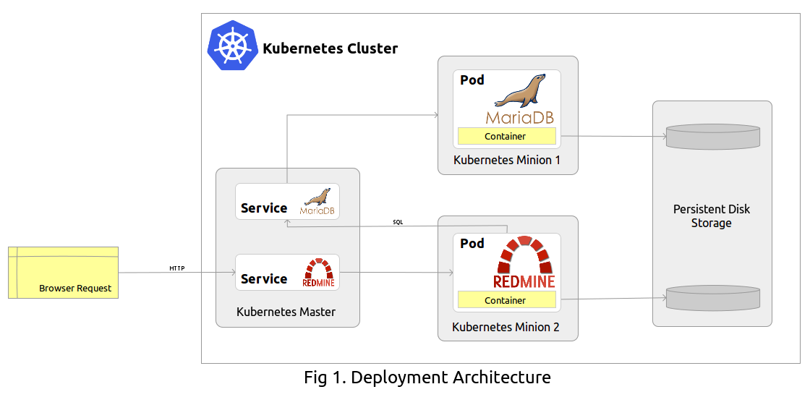

# Deploying Redmine on GKE using Bitnami Helm Classic Charts

- [TL;DR;](#tldr)
- [Introduction](#introduction)
- [Before you begin](#before-you-begin)
  - [Kubernetes environment](#kubernetes-environment)
  - [Helm Classic](#helm-classic)
  - [Bitnami Charts](#bitnami-charts)
- [Create the cluster](#create-the-cluster)
- [Deploy MariaDB](#deploy-mariadb)
- [Deploy Redmine](#deploy-redmine)
- [Accessing the Redmine application](#accessing-the-redmine-application)
- [Uninstalling Redmine](#uninstalling-redmine)
- [Configuration](#configuration)
  - [MariaDB persistence](#mariadb-persistence)
  - [Redmine persistence](#redmine-persistence)
  - [Redmine Language](#redmine-language)
  - [Redmine Admin](#redmine-admin)
  - [Email Delivery](#email-delivery)

## TL;DR;

**Step 1: Create a Kubernetes cluster**

```bash
$ gcloud container clusters create my-cluster
```

**Step 2: Add the Bitnami Charts repo to Helm Classic**

```bash
$ helmc repo add bitnami https://github.com/bitnami/charts
$ helmc update
```

**Step 3: Deploy MariaDB**

```bash
$ helmc fetch bitnami/mariadb
$ helmc install mariadb
```

**Step 4: Deploy Redmine**

```bash
$ helmc fetch bitnami/redmine
$ helmc install redmine
```

To learn how you can access the Redmine application please refer to the [Accessing the Redmine Instance](#accessing-the-redmine-application) section.

## Introduction

[Redmine](http://redmine.org) is a [feature-rich](http://www.redmine.org/projects/redmine/wiki/Features) open source project management web application written using the Ruby on Rails framwork and released under the terms of the [GNU General Public License v2](http://www.gnu.org/licenses/old-licenses/gpl-2.0.html) (GPL).

In this tutorial we walk through deploying Redmine on [Google Container Engine](https://cloud.google.com/container-engine/) (GKE) using [Helm Classic](http://helm.sh/) and the [Official Bitnami Helm Classic Charts](https://github.com/bitnami/charts). The following illustration provides an overview of the deployment.



## Before you begin

### Kubernetes environment

[Kubernetes](http://kubernetes.io) is an open source container cluster manager by Google. It aims to provide a *"platform for automating deployment, scaling, and operations of application containers across clusters of hosts"*.

Before you create a Kubernetes cluster follow [these instructions](https://cloud.google.com/container-engine/docs/before-you-begin) to set up your GKE account.

### Helm

Dubbed as the Kubernetes Package Manager, Helm Classic bootstraps a Kubernetes cluster with Charts that provide ready-to-use workloads.

[Install Helm Classic](https://github.com/helm/helm-classic#installing-helm) with the following commands.

```bash
$ curl -s https://get.helm.sh | bash
$ sudo mv helmc /usr/local/bin
$ sudo chmod +x /usr/local/bin/helmc
```

### Bitnami Charts

The [Bitnami Helm Classic Charts](https://github.com/bitnami/charts) repo is the easiest way to deploy [Bitnami Docker Containers](https://bitnami.com/docker) on a Kubernetes cluster.

In addition to deploying containers on the cluster, the Bitnami Charts also set up [Container Probes](http://kubernetes.io/docs/user-guide/pod-states/#container-probes) to perform diagnostic checks on the containers to maximize the responsiveness and uptime of applications and services deployed on the cluster.

The Charts in this repo are actively developed and maintained by [Bitnami](https://bitnami.com/) so that you have a pleasant experience deploying applications on Kubernetes. So lets get started...

Add the Bitnami Charts repo to Helm Classic.

```bash
$ helmc repo add bitnami https://github.com/bitnami/charts
```

(Periodically) Update the Charts to get the latest and greatest Charts from Bitnami.

```bash
$ helmc update
```

## Create the cluster

*This is optional if you want to use an existing Kubernetes cluster.*

```bash
$ gcloud container clusters create my-cluster
```

The above command creates a cluster named `my-cluster` on GKE. You can name the cluster whatever you like.

> **Tip**:
>
> Multiple applications and services can be deployed on a single cluster and the various applications and services share the resources of the cluster thereby optimally utilizing the cluster resources. As the need arises resources can be added or removed by [resizing the cluster](https://cloud.google.com/container-engine/docs/resize-cluster).

## Deploy MariaDB

The [Bitnami Redmine Chart](https://github.com/bitnami/charts/tree/master/redmine) depends on the [Bitnami MariaDB Chart](https://github.com/bitnami/charts/tree/master/mariadb) for the database needs of the Redmine application. As such we'll first deploy the MariaDB Chart.

Begin by fetching the MariaDB Chart from the Bitnami Helm Classic Charts repo.

```bash
$ helmc fetch bitnami/mariadb
```

Bitnami Charts use [Helm Classic templates and generators](https://github.com/helm/helm-classic/blob/master/docs/generate-and-template.md) allowing users to easily update the deployment parameters. The configurable parameters are stored in the `~/.helmc/workspace/charts/mariadb/tpl/values.toml` file of the Chart and in the default configuration the administrative user `root` is created without a password. To change the defaults, update the relevant parameters.

> **Hint**:
>
> If your default editor is set to `vim` and you have issues running the following command, add `se autochdir` to your `~/.vimrc` profile and retry or directly edit `~/.helmc/workspace/charts/mariadb/tpl/values.toml` in your favourite editor.

```bash
$ helmc edit mariadb
```

> **Tip:**
>
> It's suggested to set up the administrative user `root` especially if you wish to share the MariaDB instance with other applications. This allows each application to create a database using the `root` credentials.

Refer to the [MariaDB persistence](#mariadb-persistence) section for setting up the persistence of MariaDB data.

Apply the changes.

```bash
$ helmc generate --force mariadb
```

It's time to deploy the MariaDB Chart.

```bash
$ helmc install mariadb
```

The above command deploys the MariaDB Chart on the cluster in the `default` namespace and will be accessible by any container running in the same namespace.

Using `kubectl` you can query the deployment status of the MariaDB [Replication Controller](http://kubernetes.io/docs/user-guide/replication-controller/), [Pods](http://kubernetes.io/docs/user-guide/pods/) and [Services](http://kubernetes.io/docs/user-guide/services/).

```bash
$ kubectl get rc,pods,services -l provider=mariadb,heritage=bitnami
```

*In the above command we are filtering the command output using labels used in the MariaDB Chart.*

## Deploy Redmine

With the MariaDB Chart deployed on the cluster, thus satisfying the dependencies of the Redmine Chart, we are now ready to deploy the Redmine Chart.

Fetch the Chart from the repo.

```bash
$ helmc fetch bitnami/redmine
```

Just like the MariaDB Chart, the Redmine Chart uses Helm Classic templates and generators with the configurable parameters stored in the `~/.helmc/workspace/charts/redmine/tpl/values.toml` file of the Chart.

Edit the deployment parameters.

```bash
$ helmc edit redmine
```

*or directly edit `~/.helmc/workspace/charts/redmine/tpl/values.toml` in your favourite text editor*

In the default configuration the Redmine administrator username and password credentials are `user` and `bitnami` respectively.

To configure Redmine data persistence refer to the [Redmine persistence](#redmine-persistence) section.

Refer to the [Redmine Language](#redmine-language) section to change the Redmine language which defaults to `en`.

To specify custom Redmine admin credentials, which default to `user` with password `bitnami`, refer to the [Redmine Admin](#redmine-admin) section.

For information on setting up email notifications please read the [Email Delivery](#email-delivery) section.

Once your done updating the deployment parameters, apply the changes with.

```bash
$ helmc generate --force redmine
```

And finally we're ready to deploy the Redmine Chart.

```bash
$ helmc install redmine
```

The above command deploys the Redmine Chart under the `default` namespace and the deployment status of the Redmine Replication Controller, Pods and Services can be queried.

```bash
$ kubectl get rc,pods,services -l app=redmine,heritage=bitnami
```

> **Bonus Tip**
>
> `kubectl get rc,pods,services -l heritage=bitnami` will list all the Pods and Services deployed using the Bitnami components.

## Accessing the Redmine application

The Redmine Chart exposes the HTTP interface of the Redmine application so that
the application can be accessed over the internet using the external IP address of the Redmine service.

Get the external IP address.

```bash
$ kubectl get services -l app=redmine,heritage=bitnami
NAME      CLUSTER-IP      EXTERNAL-IP      PORT(S)   AGE
redmine   10.63.248.111   104.197.247.57   80/TCP    43
```

> **Note:**
>
> You may need to execute the above command a couple of times as it could take a while for GKE to assign an external IP address to the service.

Point your web browser to the IP address listed in the `EXTERNAL-IP` column of the command output and login using the Redmine administrator account credentials as you may have configured while deploying the Redmine Chart. If the defaults were not changed, then the login credentials are

 - Username: `user`
 - Password: `bitnami`

## Uninstalling Redmine

The Redmine deployment can easily be uninstalled with Helm Classic.

```bash
$ helmc uninstall --namespace default redmine
```

The command uninstalls the Kubernetes components set up by the Redmine Chart in the `default` namespace.

Similarly, if the MariaDB deployment is not being used for any other application, you can uninstall the MariaDB Chart as well:

```bash
$ helmc uninstall --namespace default mariadb
```

To destroy the cluster in it's entirety use the following command. Note that any applications and services running on the cluster will also be removed.

```bash
$ gcloud container clusters delete my-cluster
```

If you had created `gcePersistentDisk`'s for setting up [MariaDB persistence](#mariadb-persistence) and [Redmine persistence](#redmine-persistence) you should be able to restore the deployment by simply redeploying the respective Charts with the existing disks.

However, to delete these disks:

```bash
$ gcloud compute disks delete redmine-data-disk mariadb-data-disk
```

The above command will delete both the `redmine-data-disk` and `mariadb-data-disk` disks and the data therein will be lost forever.

## Configuration

### MariaDB persistence

By default the MariaDB Chart mounts a [emptyDir](http://kubernetes.io/docs/user-guide/volumes/#emptydir) volume for the data. When a Pod is removed for any reason, the data in the `emptyDir` is deleted forever.

To persist the data across Pod shutdown and startup we should replace the `emptyDir` data volume with a persistent [storage volume](http://kubernetes.io/v1.0/docs/user-guide/volumes.html). For demonstration purposes we'll use a [gcePersistentDisk](http://kubernetes.io/docs/user-guide/volumes/#gcepersistentdisk).

Begin by creating a GCE persistent disk.

```bash
$ gcloud compute disks create mariadb-data-disk
```

Next you'll need to update the `data` volume specification in  `~/.helmc/workspace/charts/mariadb/tpl/mariadb-rc.yaml` to:

```yaml
      volumes:
      - name: data
        gcePersistentDisk:
          pdName: mariadb-data-disk
          fsType: ext4
```

Apply the changes before [deploying the MariaDB Chart](#deploy-mariadb).

### Redmine persistence

Like the MariaDB Chart, the the Redmine Chart mounts a [emptyDir](http://kubernetes.io/docs/user-guide/volumes/#emptydir) volume for the Redmine data by default.

For the persistence of data across Pod shutdown and startup we should replace the `emptyDir` data volume with a persistent storage volume. We'll use a `gcePersistentDisk` for demonstration purposes.

Create the GCE persistent disk.

```bash
$ gcloud compute disks create redmine-data-disk
```

Update the `data` volume specification in `~/.helmc/workspace/charts/redmine/tpl/redmine-rc.yaml` to:

```yaml
      volumes:
      - name: data
        gcePersistentDisk:
          pdName: redmine-data-disk
          fsType: ext4
```

Apply the changes before [deploying the Redmine Chart](#deploy-redmine).

### Redmine Language

The Redmine application language defaults to English and can be configured using the `redmineLanguage` deployment parameter.

Please refer to the [IANA Language Subtag Registry](http://www.iana.org/assignments/language-subtag-registry) for your language code. The accepted values for the `redmineLanguage` parameter are `bg`, `cs`, `de`, `en`, `es`, `fr`, `he`, `it`, `ja`, `ko`, `nl`, `pl`, `pt`, `pt_br`, `ro`, `ru`, `sr`, `sv`, `zh` and `zh_tw`.

For example, to configure the Redmine language to Español, edit the `~/.helmc/workspace/charts/redmine/tpl/values.toml` file of the Redmine Chart and specify the following configuration.

```toml
redmineLanguage = "es"
```

Apply the changes before [deploying the Redmine Chart](#deploy-redmine).

### Redmine Admin

The default Redmine admin username and password credentials are `user` and `bitnami` respectively and the email address is set up as `user@example.com`. These parmeters can be configured using the `redmineUser`, `redminePassword` and `redmineEmail` parameters in the `~/.helmc/workspace/charts/redmine/tpl/values.toml` file of the Redmine Chart.

For example, if you want to create the admin user `jon.snow` with password `winteriscoming` and email address `jon.snow@thenightswatch.com`.

```toml
redmineUser = "jon.snow"
redminePassword = "winteriscoming"
redmineEmail = "jon.snow@thenightswatch.com"
```

Apply the changes before [deploying the Redmine Chart](#deploy-redmine).

### Email Delivery

The Redmine Chart exposes deployment parameters to easily and effortlessly enable email notifications in Redmine. By default email delivery is disabled and can be enabled by simply providing the SMTP details of the mail delivery service.

For example, to configure email delivery via Gmail, edit the `~/.helmc/workspace/charts/redmine/tpl/values.toml` file of the Redmine Chart and specify the following configuration.

```toml
smtpHost = "smtp.gmail.com"
smtpPort = "587"
smtpUser = "notifications@example.com"
smtpPassword = "secret-password"
smtpTls = "true"
```

Remember to update `notifications@example.com` and `secret-password` in the above configuration with the Gmail username and password respectively.

That's all there is to it. Go ahead and apply the changes before [deploying the Redmine Chart](#deploy-redmine).
