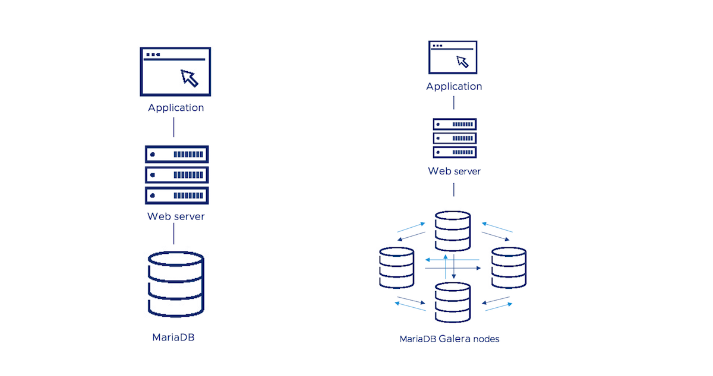

<!--- app-name: MariaDB Galera -->

# Bitnami package for MariaDB Galera

MariaDB Galera is a multi-primary database cluster solution for synchronous replication and high availability.

[Overview of MariaDB Galera](https://mariadb.com/kb/en/library/galera-cluster/)

Trademarks: This software listing is packaged by Bitnami. The respective trademarks mentioned in the offering are owned by the respective companies, and use of them does not imply any affiliation or endorsement.

## TL;DR

```console
helm install my-release oci://registry-1.docker.io/bitnamicharts/mariadb-galera
```

Looking to use MariaDB Galera in production? Try [VMware Tanzu Application Catalog](https://bitnami.com/enterprise), the enterprise edition of Bitnami Application Catalog.

## Introduction

This chart bootstraps a [MariaDB Galera](https://github.com/bitnami/containers/tree/main/bitnami/mariadb-galera) cluster on [Kubernetes](https://kubernetes.io) using the [Helm](https://helm.sh) package manager.

Bitnami charts can be used with [Kubeapps](https://kubeapps.dev/) for deployment and management of Helm Charts in clusters.

## Differences between the the Bitnami MariaDB Galera and Bitnami MariaDB Helm charts

There are two different ways to deploy a MariaDB cluster, using the MariaDB Helm chart or the MariaDB Galera Helm chart. Both solutions provide a simply and reliable way to run MariaDB in a production environment. Keep reading to discover the differences between them and check which one better suits your needs.

- The MariaDB Galera Helm chart configures a cluster with three nodes by default, all of them acting as master nodes with writing / reading permissions. The MariaDB Helm chart deploys one node that you can use as a single-node application database.
- The MariaDB Galera Helm chart provides a cluster with both read and write scalability since all nodes acts as master nodes (multi-master topology) while a cluster comprised of several MariaDB nodes will establish the master-slave topology.
- The MariaDB Galera Helm chart deploys a cluster with synchronous replication, avoiding data loss if any node fails.
- The MariaDB Galera Helm chart cluster ensures high-availability thanks to automatic membership control, failed nodes are drop from the cluster.

The following diagram shows you the options you have for using Bitnami's MariaDB solutions in your deployments: either as a single-node database (MariaDB) or as a multi-master cluster (MariaDB Galera).



## Prerequisites

- Kubernetes 1.23+
- Helm 3.8.0+
- PV provisioner support in the underlying infrastructure

## Installing the Chart

To install the chart with the release name `my-release`:

```console
helm install my-release oci://REGISTRY_NAME/REPOSITORY_NAME/mariadb-galera
```

> Note: You need to substitute the placeholders `REGISTRY_NAME` and `REPOSITORY_NAME` with a reference to your Helm chart registry and repository. For example, in the case of Bitnami, you need to use `REGISTRY_NAME=registry-1.docker.io` and `REPOSITORY_NAME=bitnamicharts`.

The command deploys MariaDB Galera on the Kubernetes cluster in the default configuration. The [Parameters](#parameters) section lists the parameters that can be configured during installation.

> **Tip**: List all releases using `helm list`

## Uninstalling the Chart

For a graceful termination, set the replica count of the Pods in the `mariadb-galera` StatefulSet to `0`:

```console
kubectl scale sts my-release-mariadb-galera --replicas=0
```

To uninstall/delete the `my-release` release:

```console
helm delete --purge my-release
```

The command removes all the Kubernetes components associated with the chart and deletes the release.

## Configuration and installation details

### Resource requests and limits

Bitnami charts allow setting resource requests and limits for all containers inside the chart deployment. These are inside the `resources` value (check parameter table). Setting requests is essential for production workloads and these should be adapted to your specific use case.

To make this process easier, the chart contains the `resourcesPreset` values, which automatically sets the `resources` section according to different presets. Check these presets in [the bitnami/common chart](https://github.com/bitnami/charts/blob/main/bitnami/common/templates/_resources.tpl#L15). However, in production workloads using `resourcePreset` is discouraged as it may not fully adapt to your specific needs. Find more information on container resource management in the [official Kubernetes documentation](https://kubernetes.io/docs/concepts/configuration/manage-resources-containers/).

### [Rolling VS Immutable tags](https://docs.vmware.com/en/VMware-Tanzu-Application-Catalog/services/tutorials/GUID-understand-rolling-tags-containers-index.html)

It is strongly recommended to use immutable tags in a production environment. This ensures your deployment does not change automatically if the same tag is updated with a different image.

Bitnami will release a new chart updating its containers if a new version of the main container, significant changes, or critical vulnerabilities exist.

### Change MariaDB version

To modify the MariaDB version used in this chart you can specify a [valid image tag](https://hub.docker.com/r/bitnami/mariadb-galera/tags/) using the `image.tag` parameter. For example, `image.tag=X.Y.Z`. This approach is also applicable to other images like exporters.

### LDAP

LDAP support can be enabled in the chart by specifying the `ldap.` parameters while creating a release. The following parameters should be configured to properly enable the LDAP support in the chart.

- `ldap.enabled`: Enable LDAP support. Defaults to `false`.
- `ldap.uri`: LDAP URL beginning in the form `ldap[s]://<hostname>:<port>`. No defaults.
- `ldap.base`: LDAP base DN. No defaults.
- `ldap.binddn`: LDAP bind DN. No defaults.
- `ldap.bindpw`: LDAP bind password. No defaults.
- `ldap.bslookup`: LDAP base lookup. No defaults.
- `ldap.nss_initgroups_ignoreusers`: LDAP ignored users. `root,nslcd`.
- `ldap.scope`: LDAP search scope. No defaults.
- `ldap.filter`: LDAP custom search filter. No defaults.
- `ldap.map`: LDAP custom map to use. No defaults.
- `ldap.tls_reqcert`: LDAP TLS check on server certificates. No defaults.

For example:

```console
ldap.enabled="true"
ldap.uri="ldap://my_ldap_server"
ldap.base="dc=example,dc=org"
ldap.binddn="cn=admin,dc=example,dc=org"
ldap.bindpw="admin"
ldap.bslookup="ou=group-ok,dc=example,dc=org"
ldap.nss_initgroups_ignoreusers="root,nslcd"
ldap.scope="sub"
ldap.filter="AccountName"
ldap.map="number"
ldap.tls_reqcert="demand"
```

Next, login to the MariaDB server using the `mysql` client and add the PAM authenticated LDAP users.

For example,

```mysql
CREATE USER 'bitnami'@'localhost' IDENTIFIED VIA pam USING 'mariadb';
```

With the above example, when the `bitnami` user attempts to login to the MariaDB server, he/she will be authenticated against the LDAP server.

### Securing traffic using TLS

TLS support can be enabled in the chart by specifying the `tls.` parameters while creating a release. The following parameters should be configured to properly enable the TLS support in the chart:

- `tls.enabled`: Enable TLS support. Defaults to `false`
- `tls.certificatesSecret`: Name of the secret that contains the certificates. No defaults.
- `tls.certFilename`: Certificate filename. No defaults.
- `tls.certKeyFilename`: Certificate key filename. No defaults.
- `tls.certCAFilename`: CA Certificate filename. No defaults.

For example:

First, create the secret with the cetificates files:

```console
kubectl create secret generic certificates-tls-secret --from-file=./cert.pem --from-file=./cert.key --from-file=./ca.pem
```

Then, use the following parameters:

```console
tls.enabled="true"
tls.certificatesSecret="certificates-tls-secret"
tls.certFilename="cert.pem"
tls.certKeyFilename="cert.key"
tls.certCAFilename="ca.pem"
```

### Initialize a fresh instance

The [Bitnami MariaDB Galera](https://github.com/bitnami/containers/tree/main/bitnami/mariadb-galera) image allows you to use your custom scripts to initialize a fresh instance. In order to execute the scripts, they must be located inside the chart folder `files/docker-entrypoint-initdb.d` so they can be consumed as a ConfigMap.

Alternatively, you can specify custom scripts using the `initdbScripts` parameter as dict.

In addition to these options, you can also set an external ConfigMap with all the initialization scripts. This is done by setting the `initdbScriptsConfigMap` parameter. Note that this will override the two previous options.

The allowed extensions are `.sh`, `.sql` and `.sql.gz`.

Take into account those scripts are treated differently depending on the extension. While the `.sh` scripts are executed in all the nodes; the `.sql` and `.sql.gz` scripts are only executed in the bootstrap node. The reason behind this differentiation is that the `.sh` scripts allow adding conditions to determine what is the node running the script, while these conditions can't be set using `.sql` nor `sql.gz` files. This way it is possible to cover different use cases depending on their needs.

If using a `.sh` script you want to do a "one-time" action like creating a database, you need to add a condition in your `.sh` script to be executed only in one of the nodes, such as

```yaml
initdbScripts:
  my_init_script.sh: |
     #!/bin/sh
     if [[ $(hostname) == *-0  ]]; then
       echo "First node"
       mysql -P 3306 -uroot -prandompassword -e "create database new_database";
     else
       echo "No first node"
     fi
```

### Extra Init Containers

The feature allows for specifying a template string for a initContainer in the pod. Usecases include situations when you need some pre-run setup. For example, in IKS (IBM Cloud Kubernetes Service), non-root users do not have write permission on the volume mount path for NFS-powered file storage. So, you could use a initcontainer to `chown` the mount. See a example below, where we add an initContainer on the pod that reports to an external resource that the db is going to starting.
`values.yaml`

```yaml
extraInitContainers:
- name: initcontainer
  image: bitnami/minideb
  command: ["/bin/sh", "-c"]
  args:
    - install_packages curl && curl http://api-service.local/db/starting;
```

### Extra Containers

The feature allows for specifying additional containers in the pod. Usecases include situations when you need to run some sidecar containers. For example, you can observe if mysql in pod is running and report to some service discovery software like eureka. Example:
`values.yaml`

```yaml
extraContainers:
- name: '{{ .Chart.Name }}-eureka-sidecar'
  image: 'image:tag'
  env:
  - name: SERVICE_NAME
    value: '{{ template "common.names.fullname" . }}'
  - name: EUREKA_APP_NAME
    value: '{{ template "common.names.name" . }}'
  - name: MARIADB_USER
    value: '{{ .Values.db.user }}'
  - name: MARIADB_PASSWORD
    valueFrom:
      secretKeyRef:
        name: '{{ template "common.names.fullname" . }}'
        key: mariadb-password
  resources:
    limits:
      cpu: 100m
      memory: 20Mi
    requests:
      cpu: 50m
      memory: 10Mi
```

### Bootstraping a node other than 0

> Note: Some of these procedures can lead to data loss, always make a backup beforehand.

To restart the cluster you need to check the state in which it is after being stopped, also you will need the previous password for the `rootUser` and `mariabackup`, and the deployment name. The value of `safe_to_bootstrap` in `/bitnami/mariadb/data/grastate.dat`, will indicate if it is safe to bootstrap form that node. In the case it is other than node 0, it is needed to choose one and force the bootstraping from it. You will notice that in these cases it is needed to start the nodes in `Parallel` by setting `podManagementPolicy`.

#### Checking `safe_to_boostrap`

First you need to get the name of the persistent volume claims (pvc), for example:

```console
$ kubectl get pvc
NAME                              STATUS   VOLUME                                     CAPACITY   ACCESS MODES   STORAGECLASS   AGE
data-my-galera-mariadb-galera-0   Bound    pvc-a496aded-f604-4a2d-b934-174907c4d235   8Gi        RWO            gp2            25h
data-my-galera-mariadb-galera-1   Bound    pvc-00ba6121-9042-4760-af14-3b8a40de936c   8Gi        RWO            gp2            25h
data-my-galera-mariadb-galera-2   Bound    pvc-61644bc9-2d7d-4e84-bf32-35e59d909b05   8Gi        RWO            gp2            25h
```

The following command will print the content of `grastate.dat` for the persistent volume claim `data-my-galera-mariadb-galera-2`. This needs to be run for each of the pvc. You will need to change this name accordingly with yours for each PVC.

```console
$ kubectl run -i --rm --tty volpod --overrides='
{
    "apiVersion": "v1",
    "kind": "Pod",
    "metadata": {
        "name": "volpod"
    },
    "spec": {
        "containers": [{
            "command": [
                "cat",
                "/mnt/data/grastate.dat"
            ],
            "image": "bitnami/minideb",
            "name": "mycontainer",
            "volumeMounts": [{
                "mountPath": "/mnt",
                "name": "galeradata"
            }]
        }],
        "restartPolicy": "Never",
        "volumes": [{
            "name": "galeradata",
            "persistentVolumeClaim": {
                "claimName": "data-my-galera-mariadb-galera-2"
            }
        }]
    }
}' --image="bitnami/minideb"
```

The output should be similar to this:

```text
# GALERA saved state
version: 2.1
uuid:    6f2cbfcd-951b-11ea-a116-5f407049e57d
seqno:   25
safe_to_bootstrap: 1
```

There are two possible scenarios:

##### Only one node with `safe_to_bootstrap: 1`

In this case you will need the node number `N` and run:

```console
helm install my-release oci://REGISTRY_NAME/REPOSITORY_NAME/mariadb-galera \
--set rootUser.password=XXXX \
--set galera.mariabackup.password=YYYY \
--set galera.bootstrap.forceBootstrap=true \
--set galera.bootstrap.bootstrapFromNode=N \
--set podManagementPolicy=Parallel
```

> Note: You need to substitute the placeholders `REGISTRY_NAME` and `REPOSITORY_NAME` with a reference to your Helm chart registry and repository. For example, in the case of Bitnami, you need to use `REGISTRY_NAME=registry-1.docker.io` and `REPOSITORY_NAME=bitnamicharts`.

##### All the nodes with `safe_to_bootstrap: 0`

In this case the cluster was not stopped cleanly and you need to pick one to force the bootstrap from. The one to be chosen in the one with the highest `seqno` in `/bitnami/mariadb/data/grastate.dat`. The following example shows how to force bootstrap from node 3.

```console
helm install my-release oci://REGISTRY_NAME/REPOSITORY_NAME/mariadb-galera \
--set rootUser.password=XXXX \
--set galera.mariabackup.password=YYYY \
--set galera.bootstrap.forceBootstrap=true \
--set galera.bootstrap.bootstrapFromNode=3 \
--set galera.bootstrap.forceSafeToBootstrap=true \
--set podManagementPolicy=Parallel
```

> Note: You need to substitute the placeholders `REGISTRY_NAME` and `REPOSITORY_NAME` with a reference to your Helm chart registry and repository. For example, in the case of Bitnami, you need to use `REGISTRY_NAME=registry-1.docker.io` and `REPOSITORY_NAME=bitnamicharts`.

#### Remove the forced boostraping

After you have started the cluster by forcing the bootstraping on one of the nodes, you will need to remove the forcing so the node can restart with normality.

```console
helm upgrade my-release oci://REGISTRY_NAME/REPOSITORY_NAME/mariadb-galera \
--set rootUser.password=XXXX \
--set galera.mariabackup.password=YYYY \
--set podManagementPolicy=Parallel
```

> Note: You need to substitute the placeholders `REGISTRY_NAME` and `REPOSITORY_NAME` with a reference to your Helm chart registry and repository. For example, in the case of Bitnami, you need to use `REGISTRY_NAME=registry-1.docker.io` and `REPOSITORY_NAME=bitnamicharts`.

### Backup and restore MariaDB Galera deployments

Two different approaches are available to back up and restore Bitnami MariaDB Galera Helm chart deployments on Kubernetes:

- Back up the data from the source deployment and restore it in a new deployment using MariaDB Galera built-in backup/restore tools.
- Back up the persistent volumes from the source deployment and attach them to a new deployment using Velero, a Kubernetes backup/restore tool.

#### Method 1: Backup and restore data using MariaDB Galera built-in tools

This method involves the following steps:

- Use the *mysqldump* tool to create a snapshot of the data in the source cluster.
- Create a new MariaDB Galera Cluster deployment and forward the MariaDB Galera Cluster service port for the new deployment.
- Create and start a MariaDB Galera container image to mount a directory containing the backup file as a volume.
- Restore the data using the *mysql* client tool to import the backup to the new cluster.

> NOTE: Under this approach, it is important to create the new deployment on the destination cluster using the same credentials as the original deployment on the source cluster.

#### Method 2: Back up and restore persistent data volumes

This method involves copying the persistent data volumes for the MariaDB Galera nodes and reusing them in a new deployment with [Velero](https://velero.io/), an open source Kubernetes backup/restore tool. This method is only suitable when:

- The Kubernetes provider is [supported by Velero](https://velero.io/docs/latest/supported-providers/).
- Both clusters are on the same Kubernetes provider, as this is a requirement of [Velero's native support for migrating persistent volumes](https://velero.io/docs/latest/migration-case/).
- The restored deployment on the destination cluster will have the same name, namespace, topology and credentials as the original deployment on the source cluster.

This method involves the following steps:

- Install Velero on the source and destination clusters.
- Use Velero to back up the PersistentVolumes (PVs) used by the deployment on the source cluster.
- Use Velero to restore the backed-up PVs on the destination cluster.
- Create a new deployment on the destination cluster with the same chart, deployment name, credentials and other parameters as the original. This new deployment will use the restored PVs and hence the original data.

Refer to our detailed [tutorial on backing up and restoring MariaDB Galera chart deployments on Kubernetes](https://docs.vmware.com/en/VMware-Tanzu-Application-Catalog/services/tutorials/GUID-backup-restore-data-mariadb-galera-kubernetes-index.html), which covers both these approaches, for more information.

### Setting Pod's affinity

This chart allows you to set your custom affinity using the `affinity` parameter. Find more information about Pod's affinity in the [kubernetes documentation](https://kubernetes.io/docs/concepts/configuration/assign-pod-node/#affinity-and-anti-affinity).

As an alternative, you can use of the preset configurations for pod affinity, pod anti-affinity, and node affinity available at the [bitnami/common](https://github.com/bitnami/charts/tree/main/bitnami/common#affinities) chart. To do so, set the `podAffinityPreset`, `podAntiAffinityPreset`, or `nodeAffinityPreset` parameters.

## Persistence

The [Bitnami MariaDB Galera](https://github.com/bitnami/containers/tree/main/bitnami/mariadb-galera) image stores the MariaDB data and configurations at the `/bitnami/mariadb` path of the container.

The chart mounts a [Persistent Volume](https://kubernetes.io/docs/concepts/storage/persistent-volumes/) volume at this location. The volume is created using dynamic volume provisioning, by default. An existing PersistentVolumeClaim can be defined.

## Parameters

### Global parameters

| Name                                                  | Description                                                                                                                                                                                                                                                                                                                                                         | Value  |
| ----------------------------------------------------- | ------------------------------------------------------------------------------------------------------------------------------------------------------------------------------------------------------------------------------------------------------------------------------------------------------------------------------------------------------------------- | ------ |
| `global.imageRegistry`                                | Global Docker image registry                                                                                                                                                                                                                                                                                                                                        | `""`   |
| `global.imagePullSecrets`                             | Global Docker registry secret names as an array                                                                                                                                                                                                                                                                                                                     | `[]`   |
| `global.storageClass`                                 | Global StorageClass for Persistent Volume(s)                                                                                                                                                                                                                                                                                                                        | `""`   |
| `global.compatibility.openshift.adaptSecurityContext` | Adapt the securityContext sections of the deployment to make them compatible with Openshift restricted-v2 SCC: remove runAsUser, runAsGroup and fsGroup and let the platform use their allowed default IDs. Possible values: auto (apply if the detected running cluster is Openshift), force (perform the adaptation always), disabled (do not perform adaptation) | `auto` |

### Common parameters

| Name                     | Description                                                                                               | Value           |
| ------------------------ | --------------------------------------------------------------------------------------------------------- | --------------- |
| `kubeVersion`            | Force target Kubernetes version (using Helm capabilities if not set)                                      | `""`            |
| `nameOverride`           | String to partially override common.names.fullname template with a string (will prepend the release name) | `""`            |
| `fullnameOverride`       | String to fully override common.names.fullname template with a string                                     | `""`            |
| `namespaceOverride`      | String to fully override common.names.namespace                                                           | `""`            |
| `commonAnnotations`      | Annotations to add to all deployed objects                                                                | `{}`            |
| `commonLabels`           | Labels to add to all deployed objects                                                                     | `{}`            |
| `schedulerName`          | Name of the Kubernetes scheduler (other than default)                                                     | `""`            |
| `clusterDomain`          | Kubernetes DNS Domain name to use                                                                         | `cluster.local` |
| `extraDeploy`            | Array of extra objects to deploy with the release (evaluated as a template)                               | `[]`            |
| `diagnosticMode.enabled` | Enable diagnostic mode (all probes will be disabled and the command will be overridden)                   | `false`         |
| `diagnosticMode.command` | Command to override all containers in the deployment                                                      | `[]`            |
| `diagnosticMode.args`    | Args to override all containers in the deployment                                                         | `[]`            |

### MariaDB Galera parameters

| Name                                                        | Description                                                                                                                                                                                                                       | Value                             |
| ----------------------------------------------------------- | --------------------------------------------------------------------------------------------------------------------------------------------------------------------------------------------------------------------------------- | --------------------------------- |
| `image.registry`                                            | MariaDB Galera image registry                                                                                                                                                                                                     | `REGISTRY_NAME`                   |
| `image.repository`                                          | MariaDB Galera image repository                                                                                                                                                                                                   | `REPOSITORY_NAME/mariadb-galera`  |
| `image.digest`                                              | MariaDB Galera image digest in the way sha256:aa.... Please note this parameter, if set, will override the tag                                                                                                                    | `""`                              |
| `image.pullPolicy`                                          | MariaDB Galera image pull policy                                                                                                                                                                                                  | `IfNotPresent`                    |
| `image.pullSecrets`                                         | Specify docker-registry secret names as an array                                                                                                                                                                                  | `[]`                              |
| `image.debug`                                               | Specify if debug logs should be enabled                                                                                                                                                                                           | `false`                           |
| `podManagementPolicy`                                       | StatefulSet controller supports relax its ordering guarantees while preserving its uniqueness and identity guarantees. There are two valid pod management policies: OrderedReady and Parallel                                     | `OrderedReady`                    |
| `automountServiceAccountToken`                              | Mount Service Account token in pod                                                                                                                                                                                                | `false`                           |
| `hostAliases`                                               | Add deployment host aliases                                                                                                                                                                                                       | `[]`                              |
| `service.type`                                              | Kubernetes service type                                                                                                                                                                                                           | `ClusterIP`                       |
| `service.clusterIP`                                         | Specific cluster IP when service type is cluster IP. Use `None` for headless service                                                                                                                                              | `""`                              |
| `service.ports.mysql`                                       | MariaDB service port                                                                                                                                                                                                              | `3306`                            |
| `service.nodePorts.mysql`                                   | Specify the nodePort value for the LoadBalancer and NodePort service types.                                                                                                                                                       | `""`                              |
| `service.extraPorts`                                        | Extra ports to expose (normally used with the `sidecar` value)                                                                                                                                                                    | `[]`                              |
| `service.externalIPs`                                       | External IP list to use with ClusterIP service type                                                                                                                                                                               | `[]`                              |
| `service.loadBalancerIP`                                    | `loadBalancerIP` if service type is `LoadBalancer`                                                                                                                                                                                | `""`                              |
| `service.loadBalancerSourceRanges`                          | Addresses that are allowed when svc is `LoadBalancer`                                                                                                                                                                             | `[]`                              |
| `service.externalTrafficPolicy`                             | %%MAIN_CONTAINER_NAME%% service external traffic policy                                                                                                                                                                           | `Cluster`                         |
| `service.annotations`                                       | Additional annotations for MariaDB Galera service                                                                                                                                                                                 | `{}`                              |
| `service.sessionAffinity`                                   | Session Affinity for Kubernetes service, can be "None" or "ClientIP"                                                                                                                                                              | `None`                            |
| `service.sessionAffinityConfig`                             | Additional settings for the sessionAffinity                                                                                                                                                                                       | `{}`                              |
| `service.headless.annotations`                              | Annotations for the headless service.                                                                                                                                                                                             | `{}`                              |
| `service.headless.publishNotReadyAddresses`                 | Publish not Ready MariaDB Galera pods' IPs in the headless service.                                                                                                                                                               | `true`                            |
| `networkPolicy.enabled`                                     | Enable creation of NetworkPolicy resources                                                                                                                                                                                        | `true`                            |
| `networkPolicy.allowExternal`                               | The Policy model to apply                                                                                                                                                                                                         | `true`                            |
| `networkPolicy.allowExternalEgress`                         | Allow the pod to access any range of port and all destinations.                                                                                                                                                                   | `true`                            |
| `networkPolicy.extraIngress`                                | Add extra ingress rules to the NetworkPolicy                                                                                                                                                                                      | `[]`                              |
| `networkPolicy.extraEgress`                                 | Add extra ingress rules to the NetworkPolicy                                                                                                                                                                                      | `[]`                              |
| `networkPolicy.ingressNSMatchLabels`                        | Labels to match to allow traffic from other namespaces                                                                                                                                                                            | `{}`                              |
| `networkPolicy.ingressNSPodMatchLabels`                     | Pod labels to match to allow traffic from other namespaces                                                                                                                                                                        | `{}`                              |
| `serviceAccount.create`                                     | Specify whether a ServiceAccount should be created                                                                                                                                                                                | `true`                            |
| `serviceAccount.name`                                       | Name of the service account to use. If not set and create is true, a name is generated using the fullname template.                                                                                                               | `""`                              |
| `serviceAccount.automountServiceAccountToken`               | Automount service account token for the server service account                                                                                                                                                                    | `false`                           |
| `serviceAccount.annotations`                                | Annotations for service account. Evaluated as a template. Only used if `create` is `true`.                                                                                                                                        | `{}`                              |
| `command`                                                   | Override default container command (useful when using custom images)                                                                                                                                                              | `[]`                              |
| `args`                                                      | Override default container args (useful when using custom images)                                                                                                                                                                 | `[]`                              |
| `extraEnvVars`                                              | Array containing extra env vars to configure MariaDB Galera replicas                                                                                                                                                              | `[]`                              |
| `extraEnvVarsCM`                                            | ConfigMap containing extra env vars to configure MariaDB Galera replicas                                                                                                                                                          | `""`                              |
| `extraEnvVarsSecret`                                        | Secret containing extra env vars to configure MariaDB Galera replicas                                                                                                                                                             | `""`                              |
| `rbac.create`                                               | Specify whether RBAC resources should be created and used                                                                                                                                                                         | `false`                           |
| `podSecurityContext.enabled`                                | Enable security context                                                                                                                                                                                                           | `true`                            |
| `podSecurityContext.fsGroupChangePolicy`                    | Set filesystem group change policy                                                                                                                                                                                                | `Always`                          |
| `podSecurityContext.sysctls`                                | Set kernel settings using the sysctl interface                                                                                                                                                                                    | `[]`                              |
| `podSecurityContext.supplementalGroups`                     | Set filesystem extra groups                                                                                                                                                                                                       | `[]`                              |
| `podSecurityContext.fsGroup`                                | Group ID for the container filesystem                                                                                                                                                                                             | `1001`                            |
| `containerSecurityContext.enabled`                          | Enabled containers' Security Context                                                                                                                                                                                              | `true`                            |
| `containerSecurityContext.seLinuxOptions`                   | Set SELinux options in container                                                                                                                                                                                                  | `{}`                              |
| `containerSecurityContext.runAsUser`                        | Set containers' Security Context runAsUser                                                                                                                                                                                        | `1001`                            |
| `containerSecurityContext.runAsGroup`                       | Set containers' Security Context runAsGroup                                                                                                                                                                                       | `1001`                            |
| `containerSecurityContext.runAsNonRoot`                     | Set container's Security Context runAsNonRoot                                                                                                                                                                                     | `true`                            |
| `containerSecurityContext.privileged`                       | Set container's Security Context privileged                                                                                                                                                                                       | `false`                           |
| `containerSecurityContext.readOnlyRootFilesystem`           | Set container's Security Context readOnlyRootFilesystem                                                                                                                                                                           | `true`                            |
| `containerSecurityContext.allowPrivilegeEscalation`         | Set container's Security Context allowPrivilegeEscalation                                                                                                                                                                         | `false`                           |
| `containerSecurityContext.capabilities.drop`                | List of capabilities to be dropped                                                                                                                                                                                                | `["ALL"]`                         |
| `containerSecurityContext.seccompProfile.type`              | Set container's Security Context seccomp profile                                                                                                                                                                                  | `RuntimeDefault`                  |
| `rootUser.user`                                             | Username for the admin user.                                                                                                                                                                                                      | `root`                            |
| `rootUser.password`                                         | Password for the admin user. Ignored if existing secret is provided.                                                                                                                                                              | `""`                              |
| `rootUser.forcePassword`                                    | Option to force users to specify a password. That is required for 'helm upgrade' to work properly.                                                                                                                                | `false`                           |
| `existingSecret`                                            | Use existing secret for password details (`rootUser.password`, `db.password`, `galera.mariabackup.password` will be ignored and picked up from this secret)                                                                       | `""`                              |
| `usePasswordFiles`                                          | Mount credentials as a files instead of using an environment variable.                                                                                                                                                            | `false`                           |
| `customPasswordFiles`                                       | Use custom password files when `usePasswordFiles` is set to `true`. Define path for keys `root`, `user`, and `mariabackup`.                                                                                                       | `{}`                              |
| `db.user`                                                   | Username of new user to create                                                                                                                                                                                                    | `""`                              |
| `db.password`                                               | Password for the new user. Ignored if existing secret is provided.                                                                                                                                                                | `""`                              |
| `db.name`                                                   | Name for new database to create                                                                                                                                                                                                   | `my_database`                     |
| `db.forcePassword`                                          | Option to force users to specify a password. That is required for 'helm upgrade' to work properly.                                                                                                                                | `false`                           |
| `galera.name`                                               | Galera cluster name                                                                                                                                                                                                               | `galera`                          |
| `galera.bootstrap.forceBootstrap`                           | Option to force the boostraping from the indicated node in `galera.bootstarp.bootstrapFromNode`                                                                                                                                   | `false`                           |
| `galera.bootstrap.bootstrapFromNode`                        | Node to bootstrap from, you will need to change this parameter in case you want to bootstrap from other node                                                                                                                      | `0`                               |
| `galera.bootstrap.forceSafeToBootstrap`                     | Force `safe_to_bootstrap: 1` in `grastate.date` file                                                                                                                                                                              | `false`                           |
| `galera.mariabackup.user`                                   | MariaBackup username                                                                                                                                                                                                              | `mariabackup`                     |
| `galera.mariabackup.password`                               | MariaBackup password. Password is ignored if existingSecret is specified.                                                                                                                                                         | `""`                              |
| `galera.mariabackup.forcePassword`                          | Option to force users to specify a password. That is required for 'helm upgrade' to work properly.                                                                                                                                | `false`                           |
| `ldap.enabled`                                              | Enable LDAP support                                                                                                                                                                                                               | `false`                           |
| `ldap.uri`                                                  | LDAP URL beginning in the form `ldap`                                                                                                                                                                                             | `""`                              |
| `ldap.base`                                                 | LDAP base DN                                                                                                                                                                                                                      | `""`                              |
| `ldap.binddn`                                               | LDAP bind DN                                                                                                                                                                                                                      | `""`                              |
| `ldap.bindpw`                                               | LDAP bind password                                                                                                                                                                                                                | `""`                              |
| `ldap.bslookup`                                             | LDAP base lookup                                                                                                                                                                                                                  | `""`                              |
| `ldap.filter`                                               | LDAP custom filter                                                                                                                                                                                                                | `""`                              |
| `ldap.map`                                                  | LDAP custom map                                                                                                                                                                                                                   | `""`                              |
| `ldap.nss_initgroups_ignoreusers`                           | LDAP ignored users                                                                                                                                                                                                                | `root,nslcd`                      |
| `ldap.scope`                                                | LDAP search scope                                                                                                                                                                                                                 | `""`                              |
| `ldap.tls_reqcert`                                          | LDAP TLS check on server certificates                                                                                                                                                                                             | `""`                              |
| `tls.enabled`                                               | Enable TLS support for replication traffic                                                                                                                                                                                        | `false`                           |
| `tls.autoGenerated`                                         | Generate automatically self-signed TLS certificates                                                                                                                                                                               | `false`                           |
| `tls.certificatesSecret`                                    | Name of the secret that contains the certificates                                                                                                                                                                                 | `""`                              |
| `tls.certFilename`                                          | Certificate filename                                                                                                                                                                                                              | `""`                              |
| `tls.certKeyFilename`                                       | Certificate key filename                                                                                                                                                                                                          | `""`                              |
| `tls.certCAFilename`                                        | CA Certificate filename                                                                                                                                                                                                           | `""`                              |
| `mariadbConfiguration`                                      | Configuration for the MariaDB server                                                                                                                                                                                              | `""`                              |
| `configurationConfigMap`                                    | ConfigMap with the MariaDB configuration files (Note: Overrides `mariadbConfiguration`). The value is evaluated as a template.                                                                                                    | `""`                              |
| `initdbScripts`                                             | Specify dictionary of scripts to be run at first boot                                                                                                                                                                             | `{}`                              |
| `initdbScriptsConfigMap`                                    | ConfigMap with the initdb scripts (Note: Overrides `initdbScripts`)                                                                                                                                                               | `""`                              |
| `extraFlags`                                                | MariaDB additional command line flags                                                                                                                                                                                             | `""`                              |
| `replicaCount`                                              | Desired number of cluster nodes                                                                                                                                                                                                   | `3`                               |
| `updateStrategy.type`                                       | updateStrategy for MariaDB Master StatefulSet                                                                                                                                                                                     | `RollingUpdate`                   |
| `podLabels`                                                 | Extra labels for MariaDB Galera pods                                                                                                                                                                                              | `{}`                              |
| `podAnnotations`                                            | Annotations for MariaDB Galera  pods                                                                                                                                                                                              | `{}`                              |
| `podAffinityPreset`                                         | Pod affinity preset. Ignored if `affinity` is set. Allowed values: `soft` or `hard`                                                                                                                                               | `""`                              |
| `podAntiAffinityPreset`                                     | Pod anti-affinity preset. Ignored if `affinity` is set. Allowed values: `soft` or `hard`                                                                                                                                          | `soft`                            |
| `nodeAffinityPreset.type`                                   | Node affinity preset type. Ignored if `affinity` is set. Allowed values: `soft` or `hard`                                                                                                                                         | `""`                              |
| `nodeAffinityPreset.key`                                    | Node label key to match. Ignored if `affinity` is set.                                                                                                                                                                            | `""`                              |
| `nodeAffinityPreset.values`                                 | Node label values to match. Ignored if `affinity` is set.                                                                                                                                                                         | `[]`                              |
| `affinity`                                                  | Affinity for pod assignment                                                                                                                                                                                                       | `{}`                              |
| `nodeSelector`                                              | Node labels for pod assignment                                                                                                                                                                                                    | `{}`                              |
| `tolerations`                                               | Tolerations for pod assignment                                                                                                                                                                                                    | `[]`                              |
| `topologySpreadConstraints`                                 | Topology Spread Constraints for pods assignment                                                                                                                                                                                   | `[]`                              |
| `lifecycleHooks`                                            | for the galera container(s) to automate configuration before or after startup                                                                                                                                                     | `{}`                              |
| `containerPorts.mysql`                                      | mariadb database container port                                                                                                                                                                                                   | `3306`                            |
| `containerPorts.galera`                                     | galera cluster container port                                                                                                                                                                                                     | `4567`                            |
| `containerPorts.ist`                                        | galera IST container port                                                                                                                                                                                                         | `4568`                            |
| `containerPorts.sst`                                        | galera SST container port                                                                                                                                                                                                         | `4444`                            |
| `persistence.enabled`                                       | Enable persistence using PVC                                                                                                                                                                                                      | `true`                            |
| `persistence.existingClaim`                                 | Provide an existing `PersistentVolumeClaim`                                                                                                                                                                                       | `""`                              |
| `persistence.subPath`                                       | Subdirectory of the volume to mount                                                                                                                                                                                               | `""`                              |
| `persistence.mountPath`                                     | Path to mount the volume at                                                                                                                                                                                                       | `/bitnami/mariadb`                |
| `persistence.selector`                                      | Selector to match an existing Persistent Volume (this value is evaluated as a template)                                                                                                                                           | `{}`                              |
| `persistence.storageClass`                                  | Persistent Volume Storage Class                                                                                                                                                                                                   | `""`                              |
| `persistence.annotations`                                   | Persistent Volume Claim annotations                                                                                                                                                                                               | `{}`                              |
| `persistence.labels`                                        | Persistent Volume Claim Labels                                                                                                                                                                                                    | `{}`                              |
| `persistence.accessModes`                                   | Persistent Volume Access Modes                                                                                                                                                                                                    | `["ReadWriteOnce"]`               |
| `persistence.size`                                          | Persistent Volume Size                                                                                                                                                                                                            | `8Gi`                             |
| `priorityClassName`                                         | Priority Class Name for Statefulset                                                                                                                                                                                               | `""`                              |
| `initContainers`                                            | Additional init containers (this value is evaluated as a template)                                                                                                                                                                | `[]`                              |
| `sidecars`                                                  | Add additional sidecar containers (this value is evaluated as a template)                                                                                                                                                         | `[]`                              |
| `extraVolumes`                                              | Extra volumes                                                                                                                                                                                                                     | `[]`                              |
| `extraVolumeMounts`                                         | Mount extra volume(s)                                                                                                                                                                                                             | `[]`                              |
| `resourcesPreset`                                           | Set container resources according to one common preset (allowed values: none, nano, micro, small, medium, large, xlarge, 2xlarge). This is ignored if resources is set (resources is recommended for production).                 | `micro`                           |
| `resources`                                                 | Set container requests and limits for different resources like CPU or memory (essential for production workloads)                                                                                                                 | `{}`                              |
| `livenessProbe.enabled`                                     | Turn on and off liveness probe                                                                                                                                                                                                    | `true`                            |
| `livenessProbe.initialDelaySeconds`                         | Delay before liveness probe is initiated                                                                                                                                                                                          | `120`                             |
| `livenessProbe.periodSeconds`                               | How often to perform the probe                                                                                                                                                                                                    | `10`                              |
| `livenessProbe.timeoutSeconds`                              | When the probe times out                                                                                                                                                                                                          | `1`                               |
| `livenessProbe.failureThreshold`                            | Minimum consecutive failures for the probe                                                                                                                                                                                        | `3`                               |
| `livenessProbe.successThreshold`                            | Minimum consecutive successes for the probe                                                                                                                                                                                       | `1`                               |
| `readinessProbe.enabled`                                    | Turn on and off readiness probe                                                                                                                                                                                                   | `true`                            |
| `readinessProbe.initialDelaySeconds`                        | Delay before readiness probe is initiated                                                                                                                                                                                         | `30`                              |
| `readinessProbe.periodSeconds`                              | How often to perform the probe                                                                                                                                                                                                    | `10`                              |
| `readinessProbe.timeoutSeconds`                             | When the probe times out                                                                                                                                                                                                          | `1`                               |
| `readinessProbe.failureThreshold`                           | Minimum consecutive failures for the probe                                                                                                                                                                                        | `3`                               |
| `readinessProbe.successThreshold`                           | Minimum consecutive successes for the probe                                                                                                                                                                                       | `1`                               |
| `startupProbe.enabled`                                      | Turn on and off startup probe                                                                                                                                                                                                     | `false`                           |
| `startupProbe.initialDelaySeconds`                          | Delay before startup probe is initiated                                                                                                                                                                                           | `120`                             |
| `startupProbe.periodSeconds`                                | How often to perform the probe                                                                                                                                                                                                    | `10`                              |
| `startupProbe.timeoutSeconds`                               | When the probe times out                                                                                                                                                                                                          | `1`                               |
| `startupProbe.failureThreshold`                             | Minimum consecutive failures for the probe                                                                                                                                                                                        | `48`                              |
| `startupProbe.successThreshold`                             | Minimum consecutive successes for the probe                                                                                                                                                                                       | `1`                               |
| `customStartupProbe`                                        | Custom liveness probe for the Web component                                                                                                                                                                                       | `{}`                              |
| `customLivenessProbe`                                       | Custom liveness probe for the Web component                                                                                                                                                                                       | `{}`                              |
| `customReadinessProbe`                                      | Custom rediness probe for the Web component                                                                                                                                                                                       | `{}`                              |
| `pdb.create`                                                | Specifies whether a Pod disruption budget should be created                                                                                                                                                                       | `false`                           |
| `pdb.minAvailable`                                          | Minimum number / percentage of pods that should remain scheduled                                                                                                                                                                  | `1`                               |
| `pdb.maxUnavailable`                                        | Maximum number / percentage of pods that may be made unavailable                                                                                                                                                                  | `""`                              |
| `metrics.enabled`                                           | Start a side-car prometheus exporter                                                                                                                                                                                              | `false`                           |
| `metrics.image.registry`                                    | MariaDB Prometheus exporter image registry                                                                                                                                                                                        | `REGISTRY_NAME`                   |
| `metrics.image.repository`                                  | MariaDB Prometheus exporter image repository                                                                                                                                                                                      | `REPOSITORY_NAME/mysqld-exporter` |
| `metrics.image.digest`                                      | MariaDB Prometheus exporter image digest in the way sha256:aa.... Please note this parameter, if set, will override the tag                                                                                                       | `""`                              |
| `metrics.image.pullPolicy`                                  | MariaDB Prometheus exporter image pull policy                                                                                                                                                                                     | `IfNotPresent`                    |
| `metrics.image.pullSecrets`                                 | MariaDB Prometheus exporter image pull secrets                                                                                                                                                                                    | `[]`                              |
| `metrics.extraFlags`                                        | MariaDB Prometheus exporter additional command line flags                                                                                                                                                                         | `[]`                              |
| `metrics.resourcesPreset`                                   | Set container resources according to one common preset (allowed values: none, nano, micro, small, medium, large, xlarge, 2xlarge). This is ignored if metrics.resources is set (metrics.resources is recommended for production). | `nano`                            |
| `metrics.resources`                                         | Set container requests and limits for different resources like CPU or memory (essential for production workloads)                                                                                                                 | `{}`                              |
| `metrics.containerSecurityContext.enabled`                  | Enabled containers' Security Context                                                                                                                                                                                              | `true`                            |
| `metrics.containerSecurityContext.seLinuxOptions`           | Set SELinux options in container                                                                                                                                                                                                  | `{}`                              |
| `metrics.containerSecurityContext.runAsUser`                | Set containers' Security Context runAsUser                                                                                                                                                                                        | `1001`                            |
| `metrics.containerSecurityContext.runAsGroup`               | Set containers' Security Context runAsGroup                                                                                                                                                                                       | `1001`                            |
| `metrics.containerSecurityContext.runAsNonRoot`             | Set container's Security Context runAsNonRoot                                                                                                                                                                                     | `true`                            |
| `metrics.containerSecurityContext.privileged`               | Set container's Security Context privileged                                                                                                                                                                                       | `false`                           |
| `metrics.containerSecurityContext.readOnlyRootFilesystem`   | Set container's Security Context readOnlyRootFilesystem                                                                                                                                                                           | `true`                            |
| `metrics.containerSecurityContext.allowPrivilegeEscalation` | Set container's Security Context allowPrivilegeEscalation                                                                                                                                                                         | `false`                           |
| `metrics.containerSecurityContext.capabilities.drop`        | List of capabilities to be dropped                                                                                                                                                                                                | `["ALL"]`                         |
| `metrics.containerSecurityContext.seccompProfile.type`      | Set container's Security Context seccomp profile                                                                                                                                                                                  | `RuntimeDefault`                  |
| `metrics.containerPorts.http`                               | Container port for http                                                                                                                                                                                                           | `9104`                            |
| `metrics.service.type`                                      | Prometheus exporter service type                                                                                                                                                                                                  | `ClusterIP`                       |
| `metrics.service.port`                                      | Prometheus exporter service port                                                                                                                                                                                                  | `9104`                            |
| `metrics.service.annotations`                               | Prometheus exporter service annotations                                                                                                                                                                                           | `{}`                              |
| `metrics.service.loadBalancerIP`                            | Load Balancer IP if the Prometheus metrics server type is `LoadBalancer`                                                                                                                                                          | `""`                              |
| `metrics.service.clusterIP`                                 | Prometheus metrics service Cluster IP                                                                                                                                                                                             | `""`                              |
| `metrics.service.loadBalancerSourceRanges`                  | Prometheus metrics service Load Balancer sources                                                                                                                                                                                  | `[]`                              |
| `metrics.service.externalTrafficPolicy`                     | Prometheus metrics service external traffic policy                                                                                                                                                                                | `Cluster`                         |
| `metrics.serviceMonitor.enabled`                            | if `true`, creates a Prometheus Operator ServiceMonitor (also requires `metrics.enabled` to be `true`)                                                                                                                            | `false`                           |
| `metrics.serviceMonitor.namespace`                          | Optional namespace which Prometheus is running in                                                                                                                                                                                 | `""`                              |
| `metrics.serviceMonitor.jobLabel`                           | The name of the label on the target service to use as the job name in prometheus.                                                                                                                                                 | `""`                              |
| `metrics.serviceMonitor.interval`                           | How frequently to scrape metrics (use by default, falling back to Prometheus' default)                                                                                                                                            | `""`                              |
| `metrics.serviceMonitor.scrapeTimeout`                      | Timeout after which the scrape is ended                                                                                                                                                                                           | `""`                              |
| `metrics.serviceMonitor.selector`                           | ServiceMonitor selector labels                                                                                                                                                                                                    | `{}`                              |
| `metrics.serviceMonitor.relabelings`                        | RelabelConfigs to apply to samples before scraping                                                                                                                                                                                | `[]`                              |
| `metrics.serviceMonitor.metricRelabelings`                  | MetricRelabelConfigs to apply to samples before ingestion                                                                                                                                                                         | `[]`                              |
| `metrics.serviceMonitor.honorLabels`                        | honorLabels chooses the metric's labels on collisions with target labels                                                                                                                                                          | `false`                           |
| `metrics.serviceMonitor.labels`                             | ServiceMonitor extra labels                                                                                                                                                                                                       | `{}`                              |
| `metrics.prometheusRules.enabled`                           | if `true`, creates a Prometheus Operator PrometheusRule (also requires `metrics.enabled` to be `true`, and makes little sense without ServiceMonitor)                                                                             | `false`                           |
| `metrics.prometheusRules.additionalLabels`                  | Additional labels to add to the PrometheusRule so it is picked up by the operator                                                                                                                                                 | `{}`                              |
| `metrics.prometheusRules.rules`                             | PrometheusRule rules to configure                                                                                                                                                                                                 | `{}`                              |

The above parameters map to the env variables defined in [bitnami/mariadb-galera](https://github.com/bitnami/containers/tree/main/bitnami/mariadb-galera). For more information please refer to the [bitnami/mariadb-galera](https://github.com/bitnami/containers/tree/main/bitnami/mariadb-galera) image documentation.

Specify each parameter using the `--set key=value[,key=value]` argument to `helm install`. For example,

```console
helm install my-release \
  --set rootUser.password=secretpassword,
  --set db.user=app_database \
    oci://REGISTRY_NAME/REPOSITORY_NAME/mariadb-galera
```

> Note: You need to substitute the placeholders `REGISTRY_NAME` and `REPOSITORY_NAME` with a reference to your Helm chart registry and repository. For example, in the case of Bitnami, you need to use `REGISTRY_NAME=registry-1.docker.io` and `REPOSITORY_NAME=bitnamicharts`.

The above command sets the MariaDB `root` account password to `secretpassword`. Additionally it creates a database named `my_database`.

> NOTE: Once this chart is deployed, it is not possible to change the application's access credentials, such as usernames or passwords, using Helm. To change these application credentials after deployment, delete any persistent volumes (PVs) used by the chart and re-deploy it, or use the application's built-in administrative tools if available.

Alternatively, a YAML file that specifies the values for the parameters can be provided while installing the chart. For example,

```console
helm install my-release -f values.yaml oci://REGISTRY_NAME/REPOSITORY_NAME/mariadb-galera
```

> Note: You need to substitute the placeholders `REGISTRY_NAME` and `REPOSITORY_NAME` with a reference to your Helm chart registry and repository. For example, in the case of Bitnami, you need to use `REGISTRY_NAME=registry-1.docker.io` and `REPOSITORY_NAME=bitnamicharts`.
> **Tip**: You can use the default [values.yaml](https://github.com/bitnami/charts/tree/main/bitnami/mariadb-galera/values.yaml)

## Passing extra command-line flags to mysqld startup

While the chart allows you to specify the server configuration using the `.mariadbConfiguration` chart parameter, some options for the MariaDB server can only be specified via command line flags. For such cases, the chart exposes the `.extraFlags` parameter.

For example, if you want to enable the PAM cleartext plugin, specify the command line parameter while deploying the chart like so:

```console
helm install my-release \
  --set extraFlags="--pam-use-cleartext-plugin=ON" \
  oci://REGISTRY_NAME/REPOSITORY_NAME/mariadb-galera
```

> Note: You need to substitute the placeholders `REGISTRY_NAME` and `REPOSITORY_NAME` with a reference to your Helm chart registry and repository. For example, in the case of Bitnami, you need to use `REGISTRY_NAME=registry-1.docker.io` and `REPOSITORY_NAME=bitnamicharts`.

## Troubleshooting

Find more information about how to deal with common errors related to Bitnami's Helm charts in [this troubleshooting guide](https://docs.bitnami.com/general/how-to/troubleshoot-helm-chart-issues).

## Upgrading

It's necessary to specify the existing passwords while performing a upgrade to ensure the secrets are not updated with invalid randomly generated passwords. Remember to specify the existing values of the `rootUser.password`, `db.password` and `galera.mariabackup.password` parameters when upgrading the chart:

```console
helm upgrade my-release oci://REGISTRY_NAME/REPOSITORY_NAME/mariadb-galera \
    --set rootUser.password=[ROOT_PASSWORD] \
    --set db.password=[MARIADB_PASSWORD] \
    --set galera.mariabackup.password=[GALERA_MARIABACKUP_PASSWORD]
```

> Note: You need to substitute the placeholders `REGISTRY_NAME` and `REPOSITORY_NAME` with a reference to your Helm chart registry and repository. For example, in the case of Bitnami, you need to use `REGISTRY_NAME=registry-1.docker.io` and `REPOSITORY_NAME=bitnamicharts`.

| Note: you need to substitute the placeholders *[ROOT_PASSWORD]*, *[MARIADB_PASSWORD]* and *[MARIABACKUP_PASSWORD]* with the values obtained from instructions in the installation notes.

### To 12.0.0

This major bump changes the following security defaults:

- `runAsGroup` is changed from `0` to `1001`
- `readOnlyRootFilesystem` is set to `true`
- `resourcesPreset` is changed from `none` to the minimum size working in our test suites (NOTE: `resourcesPreset` is not meant for production usage, but `resources` adapted to your use case).
- `global.compatibility.openshift.adaptSecurityContext` is changed from `disabled` to `auto`.

This could potentially break any customization or init scripts used in your deployment. If this is the case, change the default values to the previous ones.

### To 9.0.0

This major release bumps the MariaDB version to 11.0. Follow the [upstream instructions](https://mariadb.com/kb/en/upgrading-from-mariadb-10-11-to-mariadb-11-0/) for upgrading from MariaDB 10.11 to 11.0. No major issues are expected during the upgrade.

### To 7.0.0

This major release renames several values in this chart and adds missing features, in order to be inline with the rest of assets in the Bitnami charts repository. Also, this release address issues related to cluster initialization and node's restarts.

Affected values:

- `service.port` renamed as `service.ports.mysql`.
- `service.nodePort` renamed as `service.nodePorts.mysql`.
- `securityContext` renamed as `podSecurityContext`.
- `extraInitContainers` renamed as `initContainers`.
- `prometheusRule.selector` renamed as `prometheusRule.additionalLabels`

:warning: This major release also break the Helm upgrade and therefore cause a service disruption. Next procedure is required in order to allow a rolling upgrade.
> Note
>
> - It only consider Chart upgrade, not mariadb galera upgrade. Use the same version or validate mariadb galera upgrade path
> - Pods dns name are updated. If you use a query router like proxysql or maxscale, configuration have to be updated

```console
# Export current mariadb-galera statefulset resource
kubectl get sts mariadb-galera -o yaml   > mariadb-galera-patch.yaml

# Patch the statefulset spec.serviceName from 'mariadb-galera' to 'mariadb-galera-headless'
yq -i '.spec.serviceName = "mariadb-galera-headless"' mariadb-galera-patch.yaml

# Delete the statefulset keeping the pods
kubectl delete statefulsets.apps mariadb-galera --cascade=orphan
statefulset.apps "mariadb-galera" deleted

# Apply the patched statefulset
kubectl apply -f mariadb-galera-patch.yaml

# Rollout restart statefulset (pod restart is required to take in account new configuration)
kubect rollout restart statefulset mariadb-galera
satefulset.apps/mariadb-galera restarted

# Wait for the pods to restart. Confirm the cluster heath state before run the helm upgrade
kubectl rollout status statefulset mariadb-galera -w
```

### To 5.2.0

This version introduces `bitnami/common`, a [library chart](https://helm.sh/docs/topics/library_charts/#helm) as a dependency. More documentation about this new utility could be found [here](https://github.com/bitnami/charts/tree/main/bitnami/common#bitnami-common-library-chart). Please, make sure that you have updated the chart dependencies before executing any upgrade.

### To 5.0.0

[On November 13, 2020, Helm v2 support was formally finished](https://github.com/helm/charts#status-of-the-project), this major version is the result of the required changes applied to the Helm Chart to be able to incorporate the different features added in Helm v3 and to be consistent with the Helm project itself regarding the Helm v2 EOL.

#### What changes were introduced in this major version?

- Previous versions of this Helm Chart use `apiVersion: v1` (installable by both Helm 2 and 3), this Helm Chart was updated to `apiVersion: v2` (installable by Helm 3 only). [Here](https://helm.sh/docs/topics/charts/#the-apiversion-field) you can find more information about the `apiVersion` field.
- The different fields present in the *Chart.yaml* file has been ordered alphabetically in a homogeneous way for all the Bitnami Helm Charts

#### Considerations when upgrading to this version

- If you want to upgrade to this version from a previous one installed with Helm v3, you shouldn't face any issues
- If you want to upgrade to this version using Helm v2, this scenario is not supported as this version doesn't support Helm v2 anymore
- If you installed the previous version with Helm v2 and wants to upgrade to this version with Helm v3, please refer to the [official Helm documentation](https://helm.sh/docs/topics/v2_v3_migration/#migration-use-cases) about migrating from Helm v2 to v3

#### Useful links

- <https://docs.vmware.com/en/VMware-Tanzu-Application-Catalog/services/tutorials/GUID-resolve-helm2-helm3-post-migration-issues-index.html>
- <https://helm.sh/docs/topics/v2_v3_migration/>
- <https://helm.sh/blog/migrate-from-helm-v2-to-helm-v3/>

### To 2.0.0

In this version the bootstraping was improved. Now it is possible to indicate a node where to bootstrap from, and force the parameter `safe_to_bootstrap`. This allows to handle situations where the cluster was not cleanly stopped. It should be safe to upgrade from v1 of the chart, but it is wise to create always a backup before performing operations where there is a risk of data loss.

### To 1.0.0

The [Bitnami MariaDB Galera](https://github.com/bitnami/containers/tree/main/bitnami/mariadb-galera) image was migrated to a "non-root" user approach. Previously the container ran as the `root` user and the MySQL daemon was started as the `mysql` user. From now on, both the container and the MySQL daemon run as user `1001`. You can revert this behavior by setting the parameters `securityContext.runAsUser`, and `securityContext.fsGroup` to `0`.

Consequences:

- Backwards compatibility is not guaranteed.
- Environment variables related to LDAP configuration were renamed removing the `MARIADB_` prefix. For instance, to indicate the LDAP URI to use, you must set `LDAP_URI` instead of `MARIADB_LDAP_URI`

To upgrade to `1.0.0`, install a new release of the MariaDB Galera chart, and migrate your data by creating a backup of the database, and restoring it on the new release.

## Bitnami Kubernetes Documentation

Bitnami Kubernetes documentation is available at [https://docs.bitnami.com/](https://docs.bitnami.com/). You can find there the following resources:

- [Documentation for MariaDB Galera Helm chart](https://github.com/bitnami/charts/tree/main/bitnami/mariadb-galera)
- [Get Started with Kubernetes guides](https://docs.bitnami.com/kubernetes/)
- [Kubernetes FAQs](https://docs.bitnami.com/kubernetes/faq/)
- [Kubernetes Developer guides](https://docs.vmware.com/en/VMware-Tanzu-Application-Catalog/services/tutorials/GUID-index.html)

## License

Copyright &copy; 2024 Broadcom. The term "Broadcom" refers to Broadcom Inc. and/or its subsidiaries.

Licensed under the Apache License, Version 2.0 (the "License");
you may not use this file except in compliance with the License.
You may obtain a copy of the License at

<http://www.apache.org/licenses/LICENSE-2.0>

Unless required by applicable law or agreed to in writing, software
distributed under the License is distributed on an "AS IS" BASIS,
WITHOUT WARRANTIES OR CONDITIONS OF ANY KIND, either express or implied.
See the License for the specific language governing permissions and
limitations under the License.