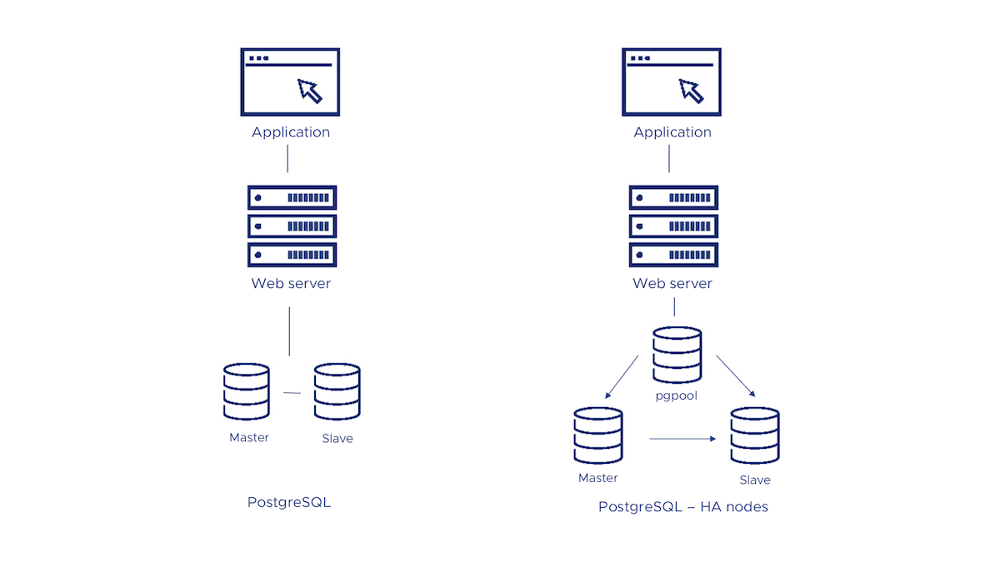

<!--- app-name: PostgreSQL HA -->

# Bitnami package for PostgreSQL HA

This PostgreSQL cluster solution includes the PostgreSQL replication manager, an open-source tool for managing replication and failover on PostgreSQL clusters.

[Overview of PostgreSQL HA](https://www.postgresql.org/)

Trademarks: This software listing is packaged by Bitnami. The respective trademarks mentioned in the offering are owned by the respective companies, and use of them does not imply any affiliation or endorsement.

## TL;DR

```console
helm install my-release oci://registry-1.docker.io/bitnamicharts/postgresql-ha
```

Looking to use PostgreSQL HA in production? Try [VMware Tanzu Application Catalog](https://bitnami.com/enterprise), the enterprise edition of Bitnami Application Catalog.

## Introduction

This [Helm](https://github.com/kubernetes/helm) chart installs [PostgreSQL](https://www.postgresql.org/) with HA architecture in a Kubernetes cluster. Welcome to [contribute](https://github.com/bitnami/charts/blob/main/CONTRIBUTING.md) to Helm Chart for PostgreSQL HA.

This Helm chart has been developed based on [bitnami/postgresql](https://github.com/bitnami/charts/tree/main/bitnami/postgresql) chart but including some changes to guarantee high availability such as:

- A new deployment, service have been added to deploy [Pgpool-II](https://pgpool.net/mediawiki/index.php/Main_Page) to act as proxy for PostgreSQL backend. It helps to reduce connection overhead, acts as a load balancer for PostgreSQL, and ensures database node failover.
- Replacing `bitnami/postgresql` with `bitnami/postgresql-repmgr` which includes and configures [repmgr](https://repmgr.org/). Repmgr ensures standby nodes assume the primary role when the primary node is unhealthy.

Bitnami charts can be used with [Kubeapps](https://kubeapps.dev/) for deployment and management of Helm Charts in clusters.

## Differences between the PostgreSQL-HA and PostgreSQL Helm charts

There are two different ways to deploy a PostgreSQL cluster, using the PostgreSQL Helm chart or the PostgreSQL High Availability (HA) Helm chart. Both solutions provide a simply and reliable way to run PostgreSQL in a production environment. Keep reading to discover the differences between them and check which one better suits your needs.

- Both the PostgreSQL HA and the PostgreSQL chart configures a cluster with a master-slave topology. The master node has writing permissions while replication is on the slaves nodes which have reading-only permissions.
- The PostgreSQL HA Helm chart deploys a cluster with three nodes by default, one for pgpool, and one master and one slave for PostgreSQL. The PostgreSQL chart configures a cluster with two nodes by default (one master and one slave).
- The PostgreSQL HA Helm chart uses pgpool to handle the connection to the nodes. pgpool is resposible to spread the queries among nodes.
- The PostgreSQL HA Helm chart includes a repmgr module that ensures high-availability thanks to automatic membership control. If the master is down, any of the slave nodes will be promoted as master to avoid data loss.

The following diagram shows you the options you have for using Bitnami's PostgreSQL solutions in your deployments:



## Prerequisites

- Kubernetes 1.23+
- Helm 3.8.0+

## Installing the Chart

To install the chart with the release name `my-release`:

```console
helm install my-release oci://REGISTRY_NAME/REPOSITORY_NAME/postgresql-ha
```

> Note: You need to substitute the placeholders `REGISTRY_NAME` and `REPOSITORY_NAME` with a reference to your Helm chart registry and repository. For example, in the case of Bitnami, you need to use `REGISTRY_NAME=registry-1.docker.io` and `REPOSITORY_NAME=bitnamicharts`.

## Configuration and installation details

### Resource requests and limits

Bitnami charts allow setting resource requests and limits for all containers inside the chart deployment. These are inside the `resources` value (check parameter table). Setting requests is essential for production workloads and these should be adapted to your specific use case.

To make this process easier, the chart contains the `resourcesPreset` values, which automatically sets the `resources` section according to different presets. Check these presets in [the bitnami/common chart](https://github.com/bitnami/charts/blob/main/bitnami/common/templates/_resources.tpl#L15). However, in production workloads using `resourcePreset` is discouraged as it may not fully adapt to your specific needs. Find more information on container resource management in the [official Kubernetes documentation](https://kubernetes.io/docs/concepts/configuration/manage-resources-containers/).

### [Rolling VS Immutable tags](https://docs.vmware.com/en/VMware-Tanzu-Application-Catalog/services/tutorials/GUID-understand-rolling-tags-containers-index.html)

It is strongly recommended to use immutable tags in a production environment. This ensures your deployment does not change automatically if the same tag is updated with a different image.

Bitnami will release a new chart updating its containers if a new version of the main container, significant changes, or critical vulnerabilities exist.

### Use a different PostgreSQL version

To modify the application version used in this chart, specify a different version of the image using the `image.tag` parameter and/or a different repository using the `image.repository` parameter.

### Use a volume for /dev/shm

When working with huge databeses, `/dev/shm` can run out of space. A way to fix this is to use the `postgresql.extraVolumes` and `postgresql.extraVolumeMounts` values. In the example below, we set an `emptyDir` volume with 512Mb:

```yaml
postgresql:
  extraVolumes:
    - name: dshm
      emptyDir:
        medium: Memory
        sizeLimit: 512Mi
  extraVolumeMounts:
    - name: dshm
      mountPath: /dev/shm
```

### Configure the way how to expose PostgreSQL

- **ClusterIP**: Exposes the service on a cluster-internal IP. Choosing this value makes the service only reachable from within the cluster. Set `service.type=ClusterIP` to choose this service type.
- **NodePort**: Exposes the service on each Node's IP at a static port (the NodePort). You will be able to contact the NodePort service, from outside the cluster, by requesting `NodeIP:NodePort`. Set `service.type=NodePort` to choose this service type.
- **LoadBalancer**: Exposes the service externally using a cloud provider's load balancer. Set `service.type=LoadBalancer` to choose this service type.

### Adjust permissions of persistent volume mountpoint

As the images run as non-root by default, it is necessary to adjust the ownership of the persistent volumes so that the containers can write data into it.

By default, the chart is configured to use Kubernetes Security Context to automatically change the ownership of the volume. However, this feature does not work in all Kubernetes distributions.
As an alternative, this chart supports using an initContainer to change the ownership of the volume before mounting it in the final destination.

You can enable this initContainer by setting `volumePermissions.enabled` to `true`.

### LDAP

LDAP support can be enabled in the chart by specifying the `ldap.` parameters while creating a release. The following parameters should be configured to properly enable the LDAP support in the chart.

- **ldap.enabled**: Enable LDAP support. Defaults to `false`.
- **ldap.uri**: LDAP URL beginning in the form `ldap[s]://<hostname>:<port>`. No defaults.
- **ldap.base**: LDAP base DN. No defaults.
- **ldap.binddn**: LDAP bind DN. No defaults.
- **ldap.bindpw**: LDAP bind password. No defaults.
- **ldap.bslookup**: LDAP base lookup. No defaults.
- **ldap.nss_initgroups_ignoreusers**: LDAP ignored users. `root,nslcd`.
- **ldap.scope**: LDAP search scope. No defaults.
- **ldap.tls_reqcert**: LDAP TLS check on server certificates. No defaults.

For example:

```text
ldap.enabled="true"
ldap.uri="ldap://my_ldap_server"
ldap.base="dc=example\,dc=org"
ldap.binddn="cn=admin\,dc=example\,dc=org"
ldap.bindpw="admin"
ldap.bslookup="ou=group-ok\,dc=example\,dc=org"
ldap.nss_initgroups_ignoreusers="root\,nslcd"
ldap.scope="sub"
ldap.tls_reqcert="demand"
```

Next, login to the PostgreSQL server using the `psql` client and add the PAM authenticated LDAP users.

> Note: Parameters including commas must be escaped as shown in the above example.

### Securing traffic using TLS

The chart handles two main flows of traffic information:

- Connections between end-clients and PgPool (sometimes referred to as *frontend* connections).
- Internal connections between PgPool and PostgreSQL nodes (sometimes referred to as *backend* connections).

The Bitnami postgresql-ha chart allows configuring the securitization of both types of traffic using TLS.

#### Encrypt traffic between clients and Pgpool (frontend)

TLS for end-client connections can be enabled in the chart by specifying the `pgpool.tls.*` parameters when installing a release. Below you can find detailed information about these parameters:

- `pgpool.tls.enabled`: Enable TLS support. Defaults to `false`.
- `pgpool.tls.certificatesSecret`: Name of an existing secret that contains the certificates. No defaults.
- `pgpool.tls.certFilename`: Certificate filename. No defaults.
- `pgpool.tls.certKeyFilename`: Certificate key filename. No defaults.

For example:

- First, create a secret with the certificates files. You will need to generate previously the certificate files:

    ```console
    kubectl create secret generic pgpool-tls-secret --from-file=./cert.crt --from-file=./cert.key --from-file=./ca.crt
    ```

> Note: Although certificate generation is out of the scope of this guide, bear in mind that PostgreSQL requires that server TLS certificates specify the actual DNS server name in the CN (Common Name) field.

- Then, install the chart using the following parameters:

    ```console
    pgpool.tls.enabled=true
    pgpool.tls.certificatesSecret="pgpool-tls-secret"
    pgpool.tls.certFilename="cert.crt"
    pgpool.tls.certKeyFilename="cert.key"
    ```

> Note: Certificates permissions: PgPool requires certain permissions on sensitive files (such as certificate keys) to start up. Due to an on-going [issue](https://github.com/kubernetes/kubernetes/issues/57923) regarding K8s permissions and the use of `containerSecurityContext.runAsUser`, an init container will adapt the permissions to ensure everything works as expected.

##### Enable client certificate authentication

When TLS is configured for *frontend* connections, the server can be configured to authenticate clients by verifying their provided TLS certificate is valid and trusted. Hence, the client will not be sent a password prompt.

You can enable this authentication feature additionally specifying the following parameter:

- `postgresql.tls.certCAFilename`: CA Certificate filename. No defaults.

    ```console
    $ psql --host postgresql-ha-pgpool -d "dbname=XXXXX user=YYYYYY sslcert=client.crt sslkey=client.key sslmode=require"
    psql (14.4)
    SSL connection (protocol: TLSv1.3, cipher: TLS_AES_256_GCM_SHA384, bits: 256, compression: off)
    Type "help" for help.

    postgres=>
    ```

Clients using this method to authenticate will be required to provide a certificate with the CN (Common Name) field matching the requested database user name. Please, refer to [the official documentation](https://www.postgresql.org/docs/current/auth-cert.html) for further information.

> Note: As with traditional password-based authentication, database users must exist in both PgPool and PostgreSQL nodes and have the correct privileges to connect to a database. You may use the `postgresql.initdbScripts` and `pgpool.customUsers` properties to create them in advance.

#### Encrypt traffic between Pgpool and PostgreSQL nodes (backend)

TLS for backend connections can be enabled in the chart by specifying the `postgresql.tls.*` parameters while creating a release. Below you can find detailed information about these parameters:

- `postgresql.tls.enabled`: Enable TLS support. Defaults to `false`
- `postgresql.tls.certificatesSecret`: Name of an existing secret that contains the certificates. No defaults.
- `postgresql.tls.certFilename`: Certificate filename. No defaults.
- `postgresql.tls.certKeyFilename`: Certificate key filename. No defaults.

For example:

- First, create a secret with the certificates files. You will need to generate previously the certificate files:

    ```console
    kubectl create secret generic postgresql-tls-secret --from-file=./cert.crt --from-file=./cert.key --from-file=./ca.crt
    ```

- Then, install the chart using the following parameters:

    ```console
    postgresql.tls.enabled=true
    postgresql.tls.certificatesSecret="postgresql-tls-secret"
    postgresql.tls.certFilename="cert.crt"
    postgresql.tls.certKeyFilename="cert.key"
    ```

> Note: Certificates permissions: PostgreSQL requires certain permissions on sensitive files (such as certificate keys) to start up. Due to an on-going [issue](https://github.com/kubernetes/kubernetes/issues/57923) regarding K8s permissions and the use of `containerSecurityContext.runAsUser`, an init container will adapt the permissions to ensure everything works as expected.

If you want to encrypt both *frontend* and *backend* traffics, you may use the same secret for Pgpool and PostgreSQL TLS configuration.

### repmgr.conf / postgresql.conf / pg_hba.conf / pgpool.conf files as configMap

This helm chart also supports to customize the whole configuration file.

You can specify the Pgpool, PostgreSQL and Repmgr configuration using the `pgpool.configuration`, `postgresql.configuration`, `postgresql.pgHbaConfiguration`, and `postgresql.repmgrConfiguration` parameters. The corresponding files will be mounted as ConfigMap to the containers and it will be used for configuring Pgpool, Repmgr and the PostgreSQL server.

In addition to this option, you can also set an external ConfigMap(s) with all the configuration files. This is done by setting the `postgresql.configurationCM` and `pgpool.configurationCM` parameters. Note that this will override the previous options.

### Allow settings to be loaded from files other than the default `postgresql.conf`

If you don't want to provide the whole PostgreSQL configuration file and only specify certain parameters, you can specify the extended configuration using the `postgresql.extendedConf` parameter. A file will be mounted as configMap to the containers adding/overwriting the default configuration using the `include_dir` directive that allows settings to be loaded from files other than the default `postgresql.conf`.

In addition to this option, you can also set an external ConfigMap with all the extra configuration files. This is done by setting the `postgresql.extendedConfCM` parameter. Note that this will override the previous option.

### Initialize a fresh instance

The [Bitnami PostgreSQL with Repmgr](https://github.com/bitnami/containers/tree/main/bitnami/postgresql-repmgr) image allows you to use your custom scripts to initialize a fresh instance. You can specify custom scripts using the `initdbScripts` parameter as dict so they can be consumed as a ConfigMap.

In addition to this option, you can also set an external ConfigMap with all the initialization scripts. This is done by setting the `initdbScriptsCM` parameter. Note that this will override the two previous options. If your initialization scripts contain sensitive information such as credentials or passwords, you can use the `initdbScriptsSecret` parameter.

The above parameters (`initdbScripts`, `initdbScriptsCM`, and `initdbScriptsSecret`) are supported in both StatefulSet by prepending `postgresql` or `pgpool` to the parameter, depending on the use case (see above parameters table).

The allowed extensions are `.sh`, `.sql` and `.sql.gz` in the **postgresql** container while only `.sh` in the case of the **pgpool** one.

+info: <https://github.com/bitnami/containers/tree/main/bitnami/postgresql#initializing-a-new-instance> and <https://github.com/bitnami/containers/tree/main/bitnami/pgpool#initializing-with-custom-scripts>

### Use of global variables

In more complex scenarios, we may have the following tree of dependencies

```text
                     +--------------+
                     |              |
        +------------+   Chart 1    +-----------+
        |            |              |           |
        |            --------+------+           |
        |                    |                  |
        |                    |                  |
        |                    |                  |
        |                    |                  |
        v                    v                  v
+-------+------+    +--------+------+  +--------+------+
|              |    |               |  |               |
| PostgreSQL HA |  | Sub-chart 1 |  | Sub-chart 2 |
|---------------|--|-------------|--|-------------|
+--------------+    +---------------+  +---------------+
```

The three charts below depend on the parent chart Chart 1. However, subcharts 1 and 2 may need to connect to PostgreSQL HA as well. In order to do so, subcharts 1 and 2 need to know the PostgreSQL HA credentials, so one option for deploying could be deploy Chart 1 with the following parameters:

```text
postgresql.postgresqlPassword=testtest
subchart1.postgresql.postgresqlPassword=testtest
subchart2.postgresql.postgresqlPassword=testtest
postgresql.postgresqlDatabase=db1
subchart1.postgresql.postgresqlDatabase=db1
subchart2.postgresql.postgresqlDatabase=db1
```

If the number of dependent sub-charts increases, installing the chart with parameters can become increasingly difficult. An alternative would be to set the credentials using global variables as follows:

```text
global.postgresql.postgresqlPassword=testtest
global.postgresql.postgresqlDatabase=db1
```

This way, the credentials will be available in all of the subcharts.

### Setting Pod's affinity

This chart allows you to set your custom affinity using the `XXX.affinity` paremeter(s). Find more information about Pod's affinity in the [kubernetes documentation](https://kubernetes.io/docs/concepts/configuration/assign-pod-node/#affinity-and-anti-affinity).

As an alternative, you can use of the preset configurations for pod affinity, pod anti-affinity, and node affinity available at the [bitnami/common](https://github.com/bitnami/charts/tree/main/bitnami/common#affinities) chart. To do so, set the `XXX.podAffinityPreset`, `XXX.podAntiAffinityPreset`, or `XXX.nodeAffinityPreset` parameters.

## Persistence

The data is persisted by default using PVC templates in the PostgreSQL statefulset. You can disable the persistence setting the `persistence.enabled` parameter to `false`.
A default `StorageClass` is needed in the Kubernetes cluster to dynamically provision the volumes. Specify another StorageClass in the `persistence.storageClass` or set `persistence.existingClaim` if you have already existing persistent volumes to use.

## Parameters

### Global parameters

| Name                                                  | Description                                                                                                                                                                                                                                                                                                                                                         | Value  |
| ----------------------------------------------------- | ------------------------------------------------------------------------------------------------------------------------------------------------------------------------------------------------------------------------------------------------------------------------------------------------------------------------------------------------------------------- | ------ |
| `global.imageRegistry`                                | Global Docker image registry                                                                                                                                                                                                                                                                                                                                        | `""`   |
| `global.imagePullSecrets`                             | Global Docker registry secret names as an array                                                                                                                                                                                                                                                                                                                     | `[]`   |
| `global.storageClass`                                 | Global StorageClass for Persistent Volume(s)                                                                                                                                                                                                                                                                                                                        | `""`   |
| `global.postgresql.username`                          | PostgreSQL username (overrides `postgresql.username`)                                                                                                                                                                                                                                                                                                               | `""`   |
| `global.postgresql.password`                          | PostgreSQL password (overrides `postgresql.password`)                                                                                                                                                                                                                                                                                                               | `""`   |
| `global.postgresql.database`                          | PostgreSQL database (overrides `postgresql.database`)                                                                                                                                                                                                                                                                                                               | `""`   |
| `global.postgresql.repmgrUsername`                    | PostgreSQL repmgr username (overrides `postgresql.repmgrUsername`)                                                                                                                                                                                                                                                                                                  | `""`   |
| `global.postgresql.repmgrPassword`                    | PostgreSQL repmgr password (overrides `postgresql.repmgrpassword`)                                                                                                                                                                                                                                                                                                  | `""`   |
| `global.postgresql.repmgrDatabase`                    | PostgreSQL repmgr database (overrides `postgresql.repmgrDatabase`)                                                                                                                                                                                                                                                                                                  | `""`   |
| `global.postgresql.existingSecret`                    | Name of existing secret to use for PostgreSQL passwords (overrides `postgresql.existingSecret`)                                                                                                                                                                                                                                                                     | `""`   |
| `global.ldap.bindpw`                                  | LDAP bind password (overrides `ldap.bindpw`)                                                                                                                                                                                                                                                                                                                        | `""`   |
| `global.ldap.existingSecret`                          | Name of existing secret to use for LDAP passwords (overrides `ldap.existingSecret`)                                                                                                                                                                                                                                                                                 | `""`   |
| `global.pgpool.adminUsername`                         | Pgpool Admin username (overrides `pgpool.adminUsername`)                                                                                                                                                                                                                                                                                                            | `""`   |
| `global.pgpool.adminPassword`                         | Pgpool Admin password (overrides `pgpool.adminPassword`)                                                                                                                                                                                                                                                                                                            | `""`   |
| `global.pgpool.existingSecret`                        | Pgpool existing secret                                                                                                                                                                                                                                                                                                                                              | `""`   |
| `global.compatibility.openshift.adaptSecurityContext` | Adapt the securityContext sections of the deployment to make them compatible with Openshift restricted-v2 SCC: remove runAsUser, runAsGroup and fsGroup and let the platform use their allowed default IDs. Possible values: auto (apply if the detected running cluster is Openshift), force (perform the adaptation always), disabled (do not perform adaptation) | `auto` |

### Common parameters

| Name                     | Description                                                                                         | Value           |
| ------------------------ | --------------------------------------------------------------------------------------------------- | --------------- |
| `kubeVersion`            | Override Kubernetes version                                                                         | `""`            |
| `nameOverride`           | String to partially override common.names.fullname template (will maintain the release name)        | `""`            |
| `fullnameOverride`       | String to fully override common.names.fullname template                                             | `""`            |
| `namespaceOverride`      | String to fully override common.names.namespace                                                     | `""`            |
| `commonLabels`           | Common labels to add to all resources (sub-charts are not considered). Evaluated as a template      | `{}`            |
| `commonAnnotations`      | Common annotations to add to all resources (sub-charts are not considered). Evaluated as a template | `{}`            |
| `clusterDomain`          | Kubernetes Cluster Domain                                                                           | `cluster.local` |
| `extraDeploy`            | Array of extra objects to deploy with the release (evaluated as a template)                         | `[]`            |
| `diagnosticMode.enabled` | Enable diagnostic mode (all probes will be disabled and the command will be overridden)             | `false`         |
| `diagnosticMode.command` | Command to override all containers in the deployment                                                | `[]`            |
| `diagnosticMode.args`    | Args to override all containers in the deployment                                                   | `[]`            |

### PostgreSQL with Repmgr parameters

| Name                                                           | Description                                                                                                                                                                                                                             | Value                               |
| -------------------------------------------------------------- | --------------------------------------------------------------------------------------------------------------------------------------------------------------------------------------------------------------------------------------- | ----------------------------------- |
| `postgresql.image.registry`                                    | PostgreSQL with Repmgr image registry                                                                                                                                                                                                   | `REGISTRY_NAME`                     |
| `postgresql.image.repository`                                  | PostgreSQL with Repmgr image repository                                                                                                                                                                                                 | `REPOSITORY_NAME/postgresql-repmgr` |
| `postgresql.image.digest`                                      | PostgreSQL image digest in the way sha256:aa.... Please note this parameter, if set, will override the tag                                                                                                                              | `""`                                |
| `postgresql.image.pullPolicy`                                  | PostgreSQL with Repmgr image pull policy                                                                                                                                                                                                | `IfNotPresent`                      |
| `postgresql.image.pullSecrets`                                 | Specify docker-registry secret names as an array                                                                                                                                                                                        | `[]`                                |
| `postgresql.image.debug`                                       | Specify if debug logs should be enabled                                                                                                                                                                                                 | `false`                             |
| `postgresql.labels`                                            | Labels to add to the StatefulSet. Evaluated as template                                                                                                                                                                                 | `{}`                                |
| `postgresql.podLabels`                                         | Labels to add to the StatefulSet pods. Evaluated as template                                                                                                                                                                            | `{}`                                |
| `postgresql.serviceAnnotations`                                | Provide any additional annotations for PostgreSQL service                                                                                                                                                                               | `{}`                                |
| `postgresql.replicaCount`                                      | Number of replicas to deploy. Use an odd number. Having 3 replicas is the minimum to get quorum when promoting a new primary.                                                                                                           | `3`                                 |
| `postgresql.updateStrategy.type`                               | Postgresql statefulset strategy type                                                                                                                                                                                                    | `RollingUpdate`                     |
| `postgresql.containerPorts.postgresql`                         | PostgreSQL port                                                                                                                                                                                                                         | `5432`                              |
| `postgresql.automountServiceAccountToken`                      | Mount Service Account token in pod                                                                                                                                                                                                      | `false`                             |
| `postgresql.hostAliases`                                       | Deployment pod host aliases                                                                                                                                                                                                             | `[]`                                |
| `postgresql.hostNetwork`                                       | Specify if host network should be enabled for PostgreSQL pod                                                                                                                                                                            | `false`                             |
| `postgresql.hostIPC`                                           | Specify if host IPC should be enabled for PostgreSQL pod                                                                                                                                                                                | `false`                             |
| `postgresql.podAnnotations`                                    | Additional pod annotations                                                                                                                                                                                                              | `{}`                                |
| `postgresql.podAffinityPreset`                                 | PostgreSQL pod affinity preset. Ignored if `postgresql.affinity` is set. Allowed values: `soft` or `hard`                                                                                                                               | `""`                                |
| `postgresql.podAntiAffinityPreset`                             | PostgreSQL pod anti-affinity preset. Ignored if `postgresql.affinity` is set. Allowed values: `soft` or `hard`                                                                                                                          | `soft`                              |
| `postgresql.nodeAffinityPreset.type`                           | PostgreSQL node affinity preset type. Ignored if `postgresql.affinity` is set. Allowed values: `soft` or `hard`                                                                                                                         | `""`                                |
| `postgresql.nodeAffinityPreset.key`                            | PostgreSQL node label key to match Ignored if `postgresql.affinity` is set.                                                                                                                                                             | `""`                                |
| `postgresql.nodeAffinityPreset.values`                         | PostgreSQL node label values to match. Ignored if `postgresql.affinity` is set.                                                                                                                                                         | `[]`                                |
| `postgresql.affinity`                                          | Affinity for PostgreSQL pods assignment                                                                                                                                                                                                 | `{}`                                |
| `postgresql.nodeSelector`                                      | Node labels for PostgreSQL pods assignment                                                                                                                                                                                              | `{}`                                |
| `postgresql.tolerations`                                       | Tolerations for PostgreSQL pods assignment                                                                                                                                                                                              | `[]`                                |
| `postgresql.topologySpreadConstraints`                         | Topology Spread Constraints for pod assignment spread across your cluster among failure-domains. Evaluated as a template                                                                                                                | `[]`                                |
| `postgresql.priorityClassName`                                 | Pod priority class                                                                                                                                                                                                                      | `""`                                |
| `postgresql.schedulerName`                                     | Use an alternate scheduler, e.g. "stork".                                                                                                                                                                                               | `""`                                |
| `postgresql.terminationGracePeriodSeconds`                     | Seconds PostgreSQL pod needs to terminate gracefully                                                                                                                                                                                    | `""`                                |
| `postgresql.podSecurityContext.enabled`                        | Enable security context for PostgreSQL with Repmgr                                                                                                                                                                                      | `true`                              |
| `postgresql.podSecurityContext.fsGroupChangePolicy`            | Set filesystem group change policy                                                                                                                                                                                                      | `Always`                            |
| `postgresql.podSecurityContext.sysctls`                        | Set kernel settings using the sysctl interface                                                                                                                                                                                          | `[]`                                |
| `postgresql.podSecurityContext.supplementalGroups`             | Set filesystem extra groups                                                                                                                                                                                                             | `[]`                                |
| `postgresql.podSecurityContext.fsGroup`                        | Group ID for the PostgreSQL with Repmgr filesystem                                                                                                                                                                                      | `1001`                              |
| `postgresql.containerSecurityContext.enabled`                  | Enabled containers' Security Context                                                                                                                                                                                                    | `true`                              |
| `postgresql.containerSecurityContext.seLinuxOptions`           | Set SELinux options in container                                                                                                                                                                                                        | `nil`                               |
| `postgresql.containerSecurityContext.runAsUser`                | Set containers' Security Context runAsUser                                                                                                                                                                                              | `1001`                              |
| `postgresql.containerSecurityContext.runAsGroup`               | Set containers' Security Context runAsGroup                                                                                                                                                                                             | `1001`                              |
| `postgresql.containerSecurityContext.runAsNonRoot`             | Set container's Security Context runAsNonRoot                                                                                                                                                                                           | `true`                              |
| `postgresql.containerSecurityContext.privileged`               | Set container's Security Context privileged                                                                                                                                                                                             | `false`                             |
| `postgresql.containerSecurityContext.readOnlyRootFilesystem`   | Set container's Security Context readOnlyRootFilesystem                                                                                                                                                                                 | `true`                              |
| `postgresql.containerSecurityContext.allowPrivilegeEscalation` | Set container's Security Context allowPrivilegeEscalation                                                                                                                                                                               | `false`                             |
| `postgresql.containerSecurityContext.capabilities.drop`        | List of capabilities to be dropped                                                                                                                                                                                                      | `["ALL"]`                           |
| `postgresql.containerSecurityContext.seccompProfile.type`      | Set container's Security Context seccomp profile                                                                                                                                                                                        | `RuntimeDefault`                    |
| `postgresql.command`                                           | Override default container command (useful when using custom images)                                                                                                                                                                    | `[]`                                |
| `postgresql.args`                                              | Override default container args (useful when using custom images)                                                                                                                                                                       | `[]`                                |
| `postgresql.lifecycleHooks`                                    | LifecycleHook to set additional configuration at startup, e.g. LDAP settings via REST API. Evaluated as a template                                                                                                                      | `{}`                                |
| `postgresql.extraEnvVars`                                      | Array containing extra environment variables                                                                                                                                                                                            | `[]`                                |
| `postgresql.extraEnvVarsCM`                                    | ConfigMap with extra environment variables                                                                                                                                                                                              | `""`                                |
| `postgresql.extraEnvVarsSecret`                                | Secret with extra environment variables                                                                                                                                                                                                 | `""`                                |
| `postgresql.extraVolumes`                                      | Extra volumes to add to the deployment                                                                                                                                                                                                  | `[]`                                |
| `postgresql.extraVolumeMounts`                                 | Extra volume mounts to add to the container. Normally used with `extraVolumes`.                                                                                                                                                         | `[]`                                |
| `postgresql.initContainers`                                    | Extra init containers to add to the deployment                                                                                                                                                                                          | `[]`                                |
| `postgresql.sidecars`                                          | Extra sidecar containers to add to the deployment                                                                                                                                                                                       | `[]`                                |
| `postgresql.resourcesPreset`                                   | Set container resources according to one common preset (allowed values: none, nano, micro, small, medium, large, xlarge, 2xlarge). This is ignored if postgresql.resources is set (postgresql.resources is recommended for production). | `micro`                             |
| `postgresql.resources`                                         | Set container requests and limits for different resources like CPU or memory (essential for production workloads)                                                                                                                       | `{}`                                |
| `postgresql.podManagementPolicy`                               | sets the pod management policy                                                                                                                                                                                                          | `Parallel`                          |
| `postgresql.livenessProbe.enabled`                             | Enable livenessProbe                                                                                                                                                                                                                    | `true`                              |
| `postgresql.livenessProbe.initialDelaySeconds`                 | Initial delay seconds for livenessProbe                                                                                                                                                                                                 | `30`                                |
| `postgresql.livenessProbe.periodSeconds`                       | Period seconds for livenessProbe                                                                                                                                                                                                        | `10`                                |
| `postgresql.livenessProbe.timeoutSeconds`                      | Timeout seconds for livenessProbe                                                                                                                                                                                                       | `5`                                 |
| `postgresql.livenessProbe.failureThreshold`                    | Failure threshold for livenessProbe                                                                                                                                                                                                     | `6`                                 |
| `postgresql.livenessProbe.successThreshold`                    | Success threshold for livenessProbe                                                                                                                                                                                                     | `1`                                 |
| `postgresql.readinessProbe.enabled`                            | Enable readinessProbe                                                                                                                                                                                                                   | `true`                              |
| `postgresql.readinessProbe.initialDelaySeconds`                | Initial delay seconds for readinessProbe                                                                                                                                                                                                | `5`                                 |
| `postgresql.readinessProbe.periodSeconds`                      | Period seconds for readinessProbe                                                                                                                                                                                                       | `10`                                |
| `postgresql.readinessProbe.timeoutSeconds`                     | Timeout seconds for readinessProbe                                                                                                                                                                                                      | `5`                                 |
| `postgresql.readinessProbe.failureThreshold`                   | Failure threshold for readinessProbe                                                                                                                                                                                                    | `6`                                 |
| `postgresql.readinessProbe.successThreshold`                   | Success threshold for readinessProbe                                                                                                                                                                                                    | `1`                                 |
| `postgresql.startupProbe.enabled`                              | Enable startupProbe                                                                                                                                                                                                                     | `false`                             |
| `postgresql.startupProbe.initialDelaySeconds`                  | Initial delay seconds for startupProbe                                                                                                                                                                                                  | `5`                                 |
| `postgresql.startupProbe.periodSeconds`                        | Period seconds for startupProbe                                                                                                                                                                                                         | `10`                                |
| `postgresql.startupProbe.timeoutSeconds`                       | Timeout seconds for startupProbe                                                                                                                                                                                                        | `5`                                 |
| `postgresql.startupProbe.failureThreshold`                     | Failure threshold for startupProbe                                                                                                                                                                                                      | `10`                                |
| `postgresql.startupProbe.successThreshold`                     | Success threshold for startupProbe                                                                                                                                                                                                      | `1`                                 |
| `postgresql.customLivenessProbe`                               | Override default liveness probe                                                                                                                                                                                                         | `{}`                                |
| `postgresql.customReadinessProbe`                              | Override default readiness probe                                                                                                                                                                                                        | `{}`                                |
| `postgresql.customStartupProbe`                                | Override default startup probe                                                                                                                                                                                                          | `{}`                                |
| `postgresql.networkPolicy.enabled`                             | Specifies whether a NetworkPolicy should be created                                                                                                                                                                                     | `true`                              |
| `postgresql.networkPolicy.allowExternal`                       | Don't require server label for connections                                                                                                                                                                                              | `true`                              |
| `postgresql.networkPolicy.allowExternalEgress`                 | Allow the pod to access any range of port and all destinations.                                                                                                                                                                         | `true`                              |
| `postgresql.networkPolicy.extraIngress`                        | Add extra ingress rules to the NetworkPolicy                                                                                                                                                                                            | `[]`                                |
| `postgresql.networkPolicy.extraEgress`                         | Add extra ingress rules to the NetworkPolicy                                                                                                                                                                                            | `[]`                                |
| `postgresql.networkPolicy.ingressNSMatchLabels`                | Labels to match to allow traffic from other namespaces                                                                                                                                                                                  | `{}`                                |
| `postgresql.networkPolicy.ingressNSPodMatchLabels`             | Pod labels to match to allow traffic from other namespaces                                                                                                                                                                              | `{}`                                |
| `postgresql.pdb.create`                                        | Specifies whether to create a Pod disruption budget for PostgreSQL with Repmgr                                                                                                                                                          | `false`                             |
| `postgresql.pdb.minAvailable`                                  | Minimum number / percentage of pods that should remain scheduled                                                                                                                                                                        | `1`                                 |
| `postgresql.pdb.maxUnavailable`                                | Maximum number / percentage of pods that may be made unavailable                                                                                                                                                                        | `""`                                |
| `postgresql.username`                                          | PostgreSQL username                                                                                                                                                                                                                     | `postgres`                          |
| `postgresql.password`                                          | PostgreSQL password                                                                                                                                                                                                                     | `""`                                |
| `postgresql.database`                                          | PostgreSQL database                                                                                                                                                                                                                     | `""`                                |
| `postgresql.existingSecret`                                    | PostgreSQL password using existing secret                                                                                                                                                                                               | `""`                                |
| `postgresql.postgresPassword`                                  | PostgreSQL password for the `postgres` user when `username` is not `postgres`                                                                                                                                                           | `""`                                |
| `postgresql.usePasswordFile`                                   | Set to `true` to mount PostgreSQL secret as a file instead of passing environment variable                                                                                                                                              | `""`                                |
| `postgresql.repmgrUsePassfile`                                 | Set to `true` to configure repmgrl to use `passfile` instead of `password` vars*:*:*:username:password" and use it to configure Repmgr instead of using password (Requires Postgresql 10+, otherwise ignored)                           | `""`                                |
| `postgresql.repmgrPassfilePath`                                | Custom path where `passfile` will be stored                                                                                                                                                                                             | `""`                                |
| `postgresql.upgradeRepmgrExtension`                            | Upgrade repmgr extension in the database                                                                                                                                                                                                | `false`                             |
| `postgresql.pgHbaTrustAll`                                     | Configures PostgreSQL HBA to trust every user                                                                                                                                                                                           | `false`                             |
| `postgresql.syncReplication`                                   | Make the replication synchronous. This will wait until the data is synchronized in all the replicas before other query can be run. This ensures the data availability at the expenses of speed.                                         | `false`                             |
| `postgresql.syncReplicationMode`                               | This specifies the method to choose synchronous standbys from the listed servers. Valid values: empty, FIRST, ANY.                                                                                                                      | `""`                                |
| `postgresql.repmgrUsername`                                    | PostgreSQL Repmgr username                                                                                                                                                                                                              | `repmgr`                            |
| `postgresql.repmgrPassword`                                    | PostgreSQL Repmgr password                                                                                                                                                                                                              | `""`                                |
| `postgresql.repmgrDatabase`                                    | PostgreSQL Repmgr database                                                                                                                                                                                                              | `repmgr`                            |
| `postgresql.repmgrLogLevel`                                    | Repmgr log level (DEBUG, INFO, NOTICE, WARNING, ERROR, ALERT, CRIT or EMERG)                                                                                                                                                            | `NOTICE`                            |
| `postgresql.repmgrConnectTimeout`                              | Repmgr backend connection timeout (in seconds)                                                                                                                                                                                          | `5`                                 |
| `postgresql.repmgrReconnectAttempts`                           | Repmgr backend reconnection attempts                                                                                                                                                                                                    | `2`                                 |
| `postgresql.repmgrReconnectInterval`                           | Repmgr backend reconnection interval (in seconds)                                                                                                                                                                                       | `3`                                 |
| `postgresql.repmgrFenceOldPrimary`                             | Set if fencing of old primary in multiple primary situation is desired                                                                                                                                                                  | `false`                             |
| `postgresql.repmgrChildNodesCheckInterval`                     | Repmgr child nodes check interval (in seconds)                                                                                                                                                                                          | `5`                                 |
| `postgresql.repmgrChildNodesConnectedMinCount`                 | Repmgr minimum number of connected child nodes before being considered as failed primary for fencing                                                                                                                                    | `1`                                 |
| `postgresql.repmgrChildNodesDisconnectTimeout`                 | Repmgr time before node will be fenced when insufficient child nodes are detected (in seconds)                                                                                                                                          | `30`                                |
| `postgresql.usePgRewind`                                       | Use pg_rewind for standby failover (experimental)                                                                                                                                                                                       | `false`                             |
| `postgresql.audit.logHostname`                                 | Add client hostnames to the log file                                                                                                                                                                                                    | `true`                              |
| `postgresql.audit.logConnections`                              | Add client log-in operations to the log file                                                                                                                                                                                            | `false`                             |
| `postgresql.audit.logDisconnections`                           | Add client log-outs operations to the log file                                                                                                                                                                                          | `false`                             |
| `postgresql.audit.pgAuditLog`                                  | Add operations to log using the pgAudit extension                                                                                                                                                                                       | `""`                                |
| `postgresql.audit.pgAuditLogCatalog`                           | Log catalog using pgAudit                                                                                                                                                                                                               | `off`                               |
| `postgresql.audit.clientMinMessages`                           | Message log level to share with the user                                                                                                                                                                                                | `error`                             |
| `postgresql.audit.logLinePrefix`                               | Template string for the log line prefix                                                                                                                                                                                                 | `""`                                |
| `postgresql.audit.logTimezone`                                 | Timezone for the log timestamps                                                                                                                                                                                                         | `""`                                |
| `postgresql.sharedPreloadLibraries`                            | Shared preload libraries (comma-separated list)                                                                                                                                                                                         | `pgaudit, repmgr`                   |
| `postgresql.maxConnections`                                    | Maximum total connections                                                                                                                                                                                                               | `""`                                |
| `postgresql.postgresConnectionLimit`                           | Maximum connections for the postgres user                                                                                                                                                                                               | `""`                                |
| `postgresql.dbUserConnectionLimit`                             | Maximum connections for the created user                                                                                                                                                                                                | `""`                                |
| `postgresql.tcpKeepalivesInterval`                             | TCP keepalives interval                                                                                                                                                                                                                 | `""`                                |
| `postgresql.tcpKeepalivesIdle`                                 | TCP keepalives idle                                                                                                                                                                                                                     | `""`                                |
| `postgresql.tcpKeepalivesCount`                                | TCP keepalives count                                                                                                                                                                                                                    | `""`                                |
| `postgresql.statementTimeout`                                  | Statement timeout                                                                                                                                                                                                                       | `""`                                |
| `postgresql.pghbaRemoveFilters`                                | Comma-separated list of patterns to remove from the pg_hba.conf file                                                                                                                                                                    | `""`                                |
| `postgresql.extraInitContainers`                               | Extra init containers                                                                                                                                                                                                                   | `[]`                                |
| `postgresql.repmgrConfiguration`                               | Repmgr configuration                                                                                                                                                                                                                    | `""`                                |
| `postgresql.configuration`                                     | PostgreSQL configuration                                                                                                                                                                                                                | `""`                                |
| `postgresql.pgHbaConfiguration`                                | PostgreSQL client authentication configuration                                                                                                                                                                                          | `""`                                |
| `postgresql.configurationCM`                                   | Name of existing ConfigMap with configuration files                                                                                                                                                                                     | `""`                                |
| `postgresql.extendedConf`                                      | Extended PostgreSQL configuration (appended to main or default configuration). Implies `volumePermissions.enabled`.                                                                                                                     | `""`                                |
| `postgresql.extendedConfCM`                                    | ConfigMap with PostgreSQL extended configuration                                                                                                                                                                                        | `""`                                |
| `postgresql.initdbScripts`                                     | Dictionary of initdb scripts                                                                                                                                                                                                            | `{}`                                |
| `postgresql.initdbScriptsCM`                                   | ConfigMap with scripts to be run at first boot                                                                                                                                                                                          | `""`                                |
| `postgresql.initdbScriptsSecret`                               | Secret with scripts to be run at first boot                                                                                                                                                                                             | `""`                                |
| `postgresql.tls.enabled`                                       | Enable TLS traffic support for end-client connections                                                                                                                                                                                   | `false`                             |
| `postgresql.tls.preferServerCiphers`                           | Whether to use the server's TLS cipher preferences rather than the client's                                                                                                                                                             | `true`                              |
| `postgresql.tls.certificatesSecret`                            | Name of an existing secret that contains the certificates                                                                                                                                                                               | `""`                                |
| `postgresql.tls.certFilename`                                  | Certificate filename                                                                                                                                                                                                                    | `""`                                |
| `postgresql.tls.certKeyFilename`                               | Certificate key filename                                                                                                                                                                                                                | `""`                                |
| `postgresql.preStopDelayAfterPgStopSeconds`                    | Minimal number of seconds preStop hook waits after postgres instance is stopped                                                                                                                                                         | `25`                                |
| `postgresql.headlessWithNotReadyAddresses`                     | set postgres headless service into publishNotReadyAddresses mode                                                                                                                                                                        | `false`                             |
| `witness.create`                                               | Create PostgreSQL witness nodes                                                                                                                                                                                                         | `false`                             |
| `witness.labels`                                               | Labels to add to the StatefulSet. Evaluated as template                                                                                                                                                                                 | `{}`                                |
| `witness.podLabels`                                            | Labels to add to the StatefulSet pods. Evaluated as template                                                                                                                                                                            | `{}`                                |
| `witness.replicaCount`                                         | Number of replicas to deploy.                                                                                                                                                                                                           | `1`                                 |
| `witness.updateStrategy.type`                                  | Postgresql statefulset strategy type                                                                                                                                                                                                    | `RollingUpdate`                     |
| `witness.containerPorts.postgresql`                            | PostgreSQL witness port                                                                                                                                                                                                                 | `5432`                              |
| `witness.automountServiceAccountToken`                         | Mount Service Account token in pod                                                                                                                                                                                                      | `false`                             |
| `witness.hostAliases`                                          | Deployment pod host aliases                                                                                                                                                                                                             | `[]`                                |
| `witness.hostNetwork`                                          | Specify if host network should be enabled for PostgreSQL witness pod                                                                                                                                                                    | `false`                             |
| `witness.hostIPC`                                              | Specify if host IPC should be enabled for PostgreSQL witness pod                                                                                                                                                                        | `false`                             |
| `witness.podAnnotations`                                       | Additional pod annotations                                                                                                                                                                                                              | `{}`                                |
| `witness.podAffinityPreset`                                    | PostgreSQL witness pod affinity preset. Ignored if `witness.affinity` is set. Allowed values: `soft` or `hard`                                                                                                                          | `""`                                |
| `witness.podAntiAffinityPreset`                                | PostgreSQL witness pod anti-affinity preset. Ignored if `witness.affinity` is set. Allowed values: `soft` or `hard`                                                                                                                     | `soft`                              |
| `witness.nodeAffinityPreset.type`                              | PostgreSQL witness node affinity preset type. Ignored if `witness.affinity` is set. Allowed values: `soft` or `hard`                                                                                                                    | `""`                                |
| `witness.nodeAffinityPreset.key`                               | PostgreSQL witness node label key to match Ignored if `witness.affinity` is set.                                                                                                                                                        | `""`                                |
| `witness.nodeAffinityPreset.values`                            | PostgreSQL witness node label values to match. Ignored if `witness.affinity` is set.                                                                                                                                                    | `[]`                                |
| `witness.affinity`                                             | Affinity for PostgreSQL witness pods assignment                                                                                                                                                                                         | `{}`                                |
| `witness.nodeSelector`                                         | Node labels for PostgreSQL witness pods assignment                                                                                                                                                                                      | `{}`                                |
| `witness.tolerations`                                          | Tolerations for PostgreSQL witness pods assignment                                                                                                                                                                                      | `[]`                                |
| `witness.topologySpreadConstraints`                            | Topology Spread Constraints for pod assignment spread across your cluster among failure-domains. Evaluated as a template                                                                                                                | `[]`                                |
| `witness.priorityClassName`                                    | Pod priority class                                                                                                                                                                                                                      | `""`                                |
| `witness.schedulerName`                                        | Use an alternate scheduler, e.g. "stork".                                                                                                                                                                                               | `""`                                |
| `witness.terminationGracePeriodSeconds`                        | Seconds PostgreSQL witness pod needs to terminate gracefully                                                                                                                                                                            | `""`                                |
| `witness.podSecurityContext.enabled`                           | Enable security context for PostgreSQL witness with Repmgr                                                                                                                                                                              | `true`                              |
| `witness.podSecurityContext.fsGroupChangePolicy`               | Set filesystem group change policy                                                                                                                                                                                                      | `Always`                            |
| `witness.podSecurityContext.sysctls`                           | Set kernel settings using the sysctl interface                                                                                                                                                                                          | `[]`                                |
| `witness.podSecurityContext.supplementalGroups`                | Set filesystem extra groups                                                                                                                                                                                                             | `[]`                                |
| `witness.podSecurityContext.fsGroup`                           | Group ID for the PostgreSQL witness with Repmgr filesystem                                                                                                                                                                              | `1001`                              |
| `witness.containerSecurityContext.enabled`                     | Enabled containers' Security Context                                                                                                                                                                                                    | `true`                              |
| `witness.containerSecurityContext.seLinuxOptions`              | Set SELinux options in container                                                                                                                                                                                                        | `nil`                               |
| `witness.containerSecurityContext.runAsUser`                   | Set containers' Security Context runAsUser                                                                                                                                                                                              | `1001`                              |
| `witness.containerSecurityContext.runAsGroup`                  | Set containers' Security Context runAsGroup                                                                                                                                                                                             | `1001`                              |
| `witness.containerSecurityContext.runAsNonRoot`                | Set container's Security Context runAsNonRoot                                                                                                                                                                                           | `true`                              |
| `witness.containerSecurityContext.privileged`                  | Set container's Security Context privileged                                                                                                                                                                                             | `false`                             |
| `witness.containerSecurityContext.readOnlyRootFilesystem`      | Set container's Security Context readOnlyRootFilesystem                                                                                                                                                                                 | `true`                              |
| `witness.containerSecurityContext.allowPrivilegeEscalation`    | Set container's Security Context allowPrivilegeEscalation                                                                                                                                                                               | `false`                             |
| `witness.containerSecurityContext.capabilities.drop`           | List of capabilities to be dropped                                                                                                                                                                                                      | `["ALL"]`                           |
| `witness.containerSecurityContext.seccompProfile.type`         | Set container's Security Context seccomp profile                                                                                                                                                                                        | `RuntimeDefault`                    |
| `witness.command`                                              | Override default container command (useful when using custom images)                                                                                                                                                                    | `[]`                                |
| `witness.args`                                                 | Override default container args (useful when using custom images)                                                                                                                                                                       | `[]`                                |
| `witness.lifecycleHooks`                                       | LifecycleHook to set additional configuration at startup, e.g. LDAP settings via REST API. Evaluated as a template                                                                                                                      | `{}`                                |
| `witness.extraEnvVars`                                         | Array containing extra environment variables                                                                                                                                                                                            | `[]`                                |
| `witness.extraEnvVarsCM`                                       | ConfigMap with extra environment variables                                                                                                                                                                                              | `""`                                |
| `witness.extraEnvVarsSecret`                                   | Secret with extra environment variables                                                                                                                                                                                                 | `""`                                |
| `witness.extraVolumes`                                         | Extra volumes to add to the deployment                                                                                                                                                                                                  | `[]`                                |
| `witness.extraVolumeMounts`                                    | Extra volume mounts to add to the container. Normally used with `extraVolumes`.                                                                                                                                                         | `[]`                                |
| `witness.initContainers`                                       | Extra init containers to add to the deployment                                                                                                                                                                                          | `[]`                                |
| `witness.sidecars`                                             | Extra sidecar containers to add to the deployment                                                                                                                                                                                       | `[]`                                |
| `witness.resourcesPreset`                                      | Set container resources according to one common preset (allowed values: none, nano, micro, small, medium, large, xlarge, 2xlarge). This is ignored if witness.resources is set (witness.resources is recommended for production).       | `micro`                             |
| `witness.resources`                                            | Set container requests and limits for different resources like CPU or memory (essential for production workloads)                                                                                                                       | `{}`                                |
| `witness.livenessProbe.enabled`                                | Enable livenessProbe                                                                                                                                                                                                                    | `true`                              |
| `witness.livenessProbe.initialDelaySeconds`                    | Initial delay seconds for livenessProbe                                                                                                                                                                                                 | `30`                                |
| `witness.livenessProbe.periodSeconds`                          | Period seconds for livenessProbe                                                                                                                                                                                                        | `10`                                |
| `witness.livenessProbe.timeoutSeconds`                         | Timeout seconds for livenessProbe                                                                                                                                                                                                       | `5`                                 |
| `witness.livenessProbe.failureThreshold`                       | Failure threshold for livenessProbe                                                                                                                                                                                                     | `6`                                 |
| `witness.livenessProbe.successThreshold`                       | Success threshold for livenessProbe                                                                                                                                                                                                     | `1`                                 |
| `witness.readinessProbe.enabled`                               | Enable readinessProbe                                                                                                                                                                                                                   | `true`                              |
| `witness.readinessProbe.initialDelaySeconds`                   | Initial delay seconds for readinessProbe                                                                                                                                                                                                | `5`                                 |
| `witness.readinessProbe.periodSeconds`                         | Period seconds for readinessProbe                                                                                                                                                                                                       | `10`                                |
| `witness.readinessProbe.timeoutSeconds`                        | Timeout seconds for readinessProbe                                                                                                                                                                                                      | `5`                                 |
| `witness.readinessProbe.failureThreshold`                      | Failure threshold for readinessProbe                                                                                                                                                                                                    | `6`                                 |
| `witness.readinessProbe.successThreshold`                      | Success threshold for readinessProbe                                                                                                                                                                                                    | `1`                                 |
| `witness.startupProbe.enabled`                                 | Enable startupProbe                                                                                                                                                                                                                     | `false`                             |
| `witness.startupProbe.initialDelaySeconds`                     | Initial delay seconds for startupProbe                                                                                                                                                                                                  | `5`                                 |
| `witness.startupProbe.periodSeconds`                           | Period seconds for startupProbe                                                                                                                                                                                                         | `10`                                |
| `witness.startupProbe.timeoutSeconds`                          | Timeout seconds for startupProbe                                                                                                                                                                                                        | `5`                                 |
| `witness.startupProbe.failureThreshold`                        | Failure threshold for startupProbe                                                                                                                                                                                                      | `10`                                |
| `witness.startupProbe.successThreshold`                        | Success threshold for startupProbe                                                                                                                                                                                                      | `1`                                 |
| `witness.customLivenessProbe`                                  | Override default liveness probe                                                                                                                                                                                                         | `{}`                                |
| `witness.customReadinessProbe`                                 | Override default readiness probe                                                                                                                                                                                                        | `{}`                                |
| `witness.customStartupProbe`                                   | Override default startup probe                                                                                                                                                                                                          | `{}`                                |
| `witness.pdb.create`                                           | Specifies whether to create a Pod disruption budget for PostgreSQL witness with Repmgr                                                                                                                                                  | `false`                             |
| `witness.pdb.minAvailable`                                     | Minimum number / percentage of pods that should remain scheduled                                                                                                                                                                        | `1`                                 |
| `witness.pdb.maxUnavailable`                                   | Maximum number / percentage of pods that may be made unavailable                                                                                                                                                                        | `""`                                |
| `witness.upgradeRepmgrExtension`                               | Upgrade repmgr extension in the database                                                                                                                                                                                                | `false`                             |
| `witness.pgHbaTrustAll`                                        | Configures PostgreSQL HBA to trust every user                                                                                                                                                                                           | `false`                             |
| `witness.repmgrLogLevel`                                       | Repmgr log level (DEBUG, INFO, NOTICE, WARNING, ERROR, ALERT, CRIT or EMERG)                                                                                                                                                            | `NOTICE`                            |
| `witness.repmgrConnectTimeout`                                 | Repmgr backend connection timeout (in seconds)                                                                                                                                                                                          | `5`                                 |
| `witness.repmgrReconnectAttempts`                              | Repmgr backend reconnection attempts                                                                                                                                                                                                    | `2`                                 |
| `witness.repmgrReconnectInterval`                              | Repmgr backend reconnection interval (in seconds)                                                                                                                                                                                       | `3`                                 |
| `witness.audit.logHostname`                                    | Add client hostnames to the log file                                                                                                                                                                                                    | `true`                              |
| `witness.audit.logConnections`                                 | Add client log-in operations to the log file                                                                                                                                                                                            | `false`                             |
| `witness.audit.logDisconnections`                              | Add client log-outs operations to the log file                                                                                                                                                                                          | `false`                             |
| `witness.audit.pgAuditLog`                                     | Add operations to log using the pgAudit extension                                                                                                                                                                                       | `""`                                |
| `witness.audit.pgAuditLogCatalog`                              | Log catalog using pgAudit                                                                                                                                                                                                               | `off`                               |
| `witness.audit.clientMinMessages`                              | Message log level to share with the user                                                                                                                                                                                                | `error`                             |
| `witness.audit.logLinePrefix`                                  | Template string for the log line prefix                                                                                                                                                                                                 | `""`                                |
| `witness.audit.logTimezone`                                    | Timezone for the log timestamps                                                                                                                                                                                                         | `""`                                |
| `witness.maxConnections`                                       | Maximum total connections                                                                                                                                                                                                               | `""`                                |
| `witness.postgresConnectionLimit`                              | Maximum connections for the postgres user                                                                                                                                                                                               | `""`                                |
| `witness.dbUserConnectionLimit`                                | Maximum connections for the created user                                                                                                                                                                                                | `""`                                |
| `witness.tcpKeepalivesInterval`                                | TCP keepalives interval                                                                                                                                                                                                                 | `""`                                |
| `witness.tcpKeepalivesIdle`                                    | TCP keepalives idle                                                                                                                                                                                                                     | `""`                                |
| `witness.tcpKeepalivesCount`                                   | TCP keepalives count                                                                                                                                                                                                                    | `""`                                |
| `witness.statementTimeout`                                     | Statement timeout                                                                                                                                                                                                                       | `""`                                |
| `witness.pghbaRemoveFilters`                                   | Comma-separated list of patterns to remove from the pg_hba.conf file                                                                                                                                                                    | `""`                                |
| `witness.extraInitContainers`                                  | Extra init containers                                                                                                                                                                                                                   | `[]`                                |
| `witness.repmgrConfiguration`                                  | Repmgr configuration                                                                                                                                                                                                                    | `""`                                |
| `witness.configuration`                                        | PostgreSQL configuration                                                                                                                                                                                                                | `""`                                |
| `witness.pgHbaConfiguration`                                   | PostgreSQL client authentication configuration                                                                                                                                                                                          | `""`                                |
| `witness.configurationCM`                                      | Name of existing ConfigMap with configuration files                                                                                                                                                                                     | `""`                                |
| `witness.extendedConf`                                         | Extended PostgreSQL configuration (appended to main or default configuration). Implies `volumePermissions.enabled`.                                                                                                                     | `""`                                |
| `witness.extendedConfCM`                                       | ConfigMap with PostgreSQL extended configuration                                                                                                                                                                                        | `""`                                |
| `witness.initdbScripts`                                        | Dictionary of initdb scripts                                                                                                                                                                                                            | `{}`                                |
| `witness.initdbScriptsCM`                                      | ConfigMap with scripts to be run at first boot                                                                                                                                                                                          | `""`                                |
| `witness.initdbScriptsSecret`                                  | Secret with scripts to be run at first boot                                                                                                                                                                                             | `""`                                |

### Pgpool parameters

| Name                                                       | Description                                                                                                                                                                                                                     | Value                    |
| ---------------------------------------------------------- | ------------------------------------------------------------------------------------------------------------------------------------------------------------------------------------------------------------------------------- | ------------------------ |
| `pgpool.image.registry`                                    | Pgpool image registry                                                                                                                                                                                                           | `REGISTRY_NAME`          |
| `pgpool.image.repository`                                  | Pgpool image repository                                                                                                                                                                                                         | `REPOSITORY_NAME/pgpool` |
| `pgpool.image.digest`                                      | Pgpool image digest in the way sha256:aa.... Please note this parameter, if set, will override the tag                                                                                                                          | `""`                     |
| `pgpool.image.pullPolicy`                                  | Pgpool image pull policy                                                                                                                                                                                                        | `IfNotPresent`           |
| `pgpool.image.pullSecrets`                                 | Specify docker-registry secret names as an array                                                                                                                                                                                | `[]`                     |
| `pgpool.image.debug`                                       | Specify if debug logs should be enabled                                                                                                                                                                                         | `false`                  |
| `pgpool.customUsers.usernames`                             | Comma or semicolon separated list of additional users that will be performing connections to the database using pgpool.                                                                                                         | `""`                     |
| `pgpool.customUsers.passwords`                             | Comma or semicolon separated list of the associated passwords for the users above. Must have the same number of elements as the usernames list.                                                                                 | `""`                     |
| `pgpool.automountServiceAccountToken`                      | Mount Service Account token in pod                                                                                                                                                                                              | `false`                  |
| `pgpool.hostAliases`                                       | Deployment pod host aliases                                                                                                                                                                                                     | `[]`                     |
| `pgpool.customUsersSecret`                                 | Name of a secret containing the usernames and passwords of accounts that will be added to pgpool_passwd                                                                                                                         | `""`                     |
| `pgpool.existingSecret`                                    | Pgpool admin password using existing secret                                                                                                                                                                                     | `""`                     |
| `pgpool.srCheckDatabase`                                   | Name of the database to perform streaming replication checks                                                                                                                                                                    | `postgres`               |
| `pgpool.labels`                                            | Labels to add to the Deployment. Evaluated as template                                                                                                                                                                          | `{}`                     |
| `pgpool.podLabels`                                         | Labels to add to the pods. Evaluated as template                                                                                                                                                                                | `{}`                     |
| `pgpool.serviceLabels`                                     | Labels to add to the service. Evaluated as template                                                                                                                                                                             | `{}`                     |
| `pgpool.serviceAnnotations`                                | Provide any additional annotations for Pgpool service                                                                                                                                                                           | `{}`                     |
| `pgpool.customLivenessProbe`                               | Override default liveness probe                                                                                                                                                                                                 | `{}`                     |
| `pgpool.customReadinessProbe`                              | Override default readiness probe                                                                                                                                                                                                | `{}`                     |
| `pgpool.customStartupProbe`                                | Override default startup probe                                                                                                                                                                                                  | `{}`                     |
| `pgpool.command`                                           | Override default container command (useful when using custom images)                                                                                                                                                            | `[]`                     |
| `pgpool.args`                                              | Override default container args (useful when using custom images)                                                                                                                                                               | `[]`                     |
| `pgpool.lifecycleHooks`                                    | LifecycleHook to set additional configuration at startup, e.g. LDAP settings via REST API. Evaluated as a template                                                                                                              | `{}`                     |
| `pgpool.extraEnvVars`                                      | Array containing extra environment variables                                                                                                                                                                                    | `[]`                     |
| `pgpool.extraEnvVarsCM`                                    | ConfigMap with extra environment variables                                                                                                                                                                                      | `""`                     |
| `pgpool.extraEnvVarsSecret`                                | Secret with extra environment variables                                                                                                                                                                                         | `""`                     |
| `pgpool.extraVolumes`                                      | Extra volumes to add to the deployment                                                                                                                                                                                          | `[]`                     |
| `pgpool.extraVolumeMounts`                                 | Extra volume mounts to add to the container. Normally used with `extraVolumes`                                                                                                                                                  | `[]`                     |
| `pgpool.initContainers`                                    | Extra init containers to add to the deployment                                                                                                                                                                                  | `[]`                     |
| `pgpool.sidecars`                                          | Extra sidecar containers to add to the deployment                                                                                                                                                                               | `[]`                     |
| `pgpool.replicaCount`                                      | The number of replicas to deploy                                                                                                                                                                                                | `1`                      |
| `pgpool.podAnnotations`                                    | Additional pod annotations                                                                                                                                                                                                      | `{}`                     |
| `pgpool.priorityClassName`                                 | Pod priority class                                                                                                                                                                                                              | `""`                     |
| `pgpool.schedulerName`                                     | Use an alternate scheduler, e.g. "stork".                                                                                                                                                                                       | `""`                     |
| `pgpool.terminationGracePeriodSeconds`                     | Seconds pgpool pod needs to terminate gracefully                                                                                                                                                                                | `""`                     |
| `pgpool.topologySpreadConstraints`                         | Topology Spread Constraints for pod assignment spread across your cluster among failure-domains. Evaluated as a template                                                                                                        | `[]`                     |
| `pgpool.podAffinityPreset`                                 | Pgpool pod affinity preset. Ignored if `pgpool.affinity` is set. Allowed values: `soft` or `hard`                                                                                                                               | `""`                     |
| `pgpool.podAntiAffinityPreset`                             | Pgpool pod anti-affinity preset. Ignored if `pgpool.affinity` is set. Allowed values: `soft` or `hard`                                                                                                                          | `soft`                   |
| `pgpool.nodeAffinityPreset.type`                           | Pgpool node affinity preset type. Ignored if `pgpool.affinity` is set. Allowed values: `soft` or `hard`                                                                                                                         | `""`                     |
| `pgpool.nodeAffinityPreset.key`                            | Pgpool node label key to match Ignored if `pgpool.affinity` is set.                                                                                                                                                             | `""`                     |
| `pgpool.nodeAffinityPreset.values`                         | Pgpool node label values to match. Ignored if `pgpool.affinity` is set.                                                                                                                                                         | `[]`                     |
| `pgpool.affinity`                                          | Affinity for Pgpool pods assignment                                                                                                                                                                                             | `{}`                     |
| `pgpool.nodeSelector`                                      | Node labels for Pgpool pods assignment                                                                                                                                                                                          | `{}`                     |
| `pgpool.tolerations`                                       | Tolerations for Pgpool pods assignment                                                                                                                                                                                          | `[]`                     |
| `pgpool.podSecurityContext.enabled`                        | Enable security context for Pgpool                                                                                                                                                                                              | `true`                   |
| `pgpool.podSecurityContext.fsGroupChangePolicy`            | Set filesystem group change policy                                                                                                                                                                                              | `Always`                 |
| `pgpool.podSecurityContext.sysctls`                        | Set kernel settings using the sysctl interface                                                                                                                                                                                  | `[]`                     |
| `pgpool.podSecurityContext.supplementalGroups`             | Set filesystem extra groups                                                                                                                                                                                                     | `[]`                     |
| `pgpool.podSecurityContext.fsGroup`                        | Group ID for the Pgpool filesystem                                                                                                                                                                                              | `1001`                   |
| `pgpool.containerSecurityContext.enabled`                  | Enabled containers' Security Context                                                                                                                                                                                            | `true`                   |
| `pgpool.containerSecurityContext.seLinuxOptions`           | Set SELinux options in container                                                                                                                                                                                                | `nil`                    |
| `pgpool.containerSecurityContext.runAsUser`                | Set containers' Security Context runAsUser                                                                                                                                                                                      | `1001`                   |
| `pgpool.containerSecurityContext.runAsGroup`               | Set containers' Security Context runAsGroup                                                                                                                                                                                     | `1001`                   |
| `pgpool.containerSecurityContext.runAsNonRoot`             | Set container's Security Context runAsNonRoot                                                                                                                                                                                   | `true`                   |
| `pgpool.containerSecurityContext.privileged`               | Set container's Security Context privileged                                                                                                                                                                                     | `false`                  |
| `pgpool.containerSecurityContext.readOnlyRootFilesystem`   | Set container's Security Context readOnlyRootFilesystem                                                                                                                                                                         | `true`                   |
| `pgpool.containerSecurityContext.allowPrivilegeEscalation` | Set container's Security Context allowPrivilegeEscalation                                                                                                                                                                       | `false`                  |
| `pgpool.containerSecurityContext.capabilities.drop`        | List of capabilities to be dropped                                                                                                                                                                                              | `["ALL"]`                |
| `pgpool.containerSecurityContext.seccompProfile.type`      | Set container's Security Context seccomp profile                                                                                                                                                                                | `RuntimeDefault`         |
| `pgpool.resourcesPreset`                                   | Set container resources according to one common preset (allowed values: none, nano, micro, small, medium, large, xlarge, 2xlarge). This is ignored if pgpool.resources is set (pgpool.resources is recommended for production). | `micro`                  |
| `pgpool.resources`                                         | Set container requests and limits for different resources like CPU or memory (essential for production workloads)                                                                                                               | `{}`                     |
| `pgpool.livenessProbe.enabled`                             | Enable livenessProbe                                                                                                                                                                                                            | `true`                   |
| `pgpool.livenessProbe.initialDelaySeconds`                 | Initial delay seconds for livenessProbe                                                                                                                                                                                         | `30`                     |
| `pgpool.livenessProbe.periodSeconds`                       | Period seconds for livenessProbe                                                                                                                                                                                                | `10`                     |
| `pgpool.livenessProbe.timeoutSeconds`                      | Timeout seconds for livenessProbe                                                                                                                                                                                               | `5`                      |
| `pgpool.livenessProbe.failureThreshold`                    | Failure threshold for livenessProbe                                                                                                                                                                                             | `5`                      |
| `pgpool.livenessProbe.successThreshold`                    | Success threshold for livenessProbe                                                                                                                                                                                             | `1`                      |
| `pgpool.readinessProbe.enabled`                            | Enable readinessProbe                                                                                                                                                                                                           | `true`                   |
| `pgpool.readinessProbe.initialDelaySeconds`                | Initial delay seconds for readinessProbe                                                                                                                                                                                        | `5`                      |
| `pgpool.readinessProbe.periodSeconds`                      | Period seconds for readinessProbe                                                                                                                                                                                               | `5`                      |
| `pgpool.readinessProbe.timeoutSeconds`                     | Timeout seconds for readinessProbe                                                                                                                                                                                              | `5`                      |
| `pgpool.readinessProbe.failureThreshold`                   | Failure threshold for readinessProbe                                                                                                                                                                                            | `5`                      |
| `pgpool.readinessProbe.successThreshold`                   | Success threshold for readinessProbe                                                                                                                                                                                            | `1`                      |
| `pgpool.startupProbe.enabled`                              | Enable startupProbe                                                                                                                                                                                                             | `false`                  |
| `pgpool.startupProbe.initialDelaySeconds`                  | Initial delay seconds for startupProbe                                                                                                                                                                                          | `5`                      |
| `pgpool.startupProbe.periodSeconds`                        | Period seconds for startupProbe                                                                                                                                                                                                 | `10`                     |
| `pgpool.startupProbe.timeoutSeconds`                       | Timeout seconds for startupProbe                                                                                                                                                                                                | `5`                      |
| `pgpool.startupProbe.failureThreshold`                     | Failure threshold for startupProbe                                                                                                                                                                                              | `10`                     |
| `pgpool.startupProbe.successThreshold`                     | Success threshold for startupProbe                                                                                                                                                                                              | `1`                      |
| `pgpool.networkPolicy.enabled`                             | Specifies whether a NetworkPolicy should be created                                                                                                                                                                             | `true`                   |
| `pgpool.networkPolicy.allowExternal`                       | Don't require server label for connections                                                                                                                                                                                      | `true`                   |
| `pgpool.networkPolicy.allowExternalEgress`                 | Allow the pod to access any range of port and all destinations.                                                                                                                                                                 | `true`                   |
| `pgpool.networkPolicy.extraIngress`                        | Add extra ingress rules to the NetworkPolicy                                                                                                                                                                                    | `[]`                     |
| `pgpool.networkPolicy.extraEgress`                         | Add extra ingress rules to the NetworkPolicy                                                                                                                                                                                    | `[]`                     |
| `pgpool.networkPolicy.ingressNSMatchLabels`                | Labels to match to allow traffic from other namespaces                                                                                                                                                                          | `{}`                     |
| `pgpool.networkPolicy.ingressNSPodMatchLabels`             | Pod labels to match to allow traffic from other namespaces                                                                                                                                                                      | `{}`                     |
| `pgpool.pdb.create`                                        | Specifies whether a Pod disruption budget should be created for Pgpool pods                                                                                                                                                     | `false`                  |
| `pgpool.pdb.minAvailable`                                  | Minimum number / percentage of pods that should remain scheduled                                                                                                                                                                | `1`                      |
| `pgpool.pdb.maxUnavailable`                                | Maximum number / percentage of pods that may be made unavailable                                                                                                                                                                | `""`                     |
| `pgpool.updateStrategy`                                    | Strategy used to replace old Pods by new ones                                                                                                                                                                                   | `{}`                     |
| `pgpool.containerPorts.postgresql`                         | Pgpool port                                                                                                                                                                                                                     | `5432`                   |
| `pgpool.minReadySeconds`                                   | How many seconds a pod needs to be ready before killing the next, during update                                                                                                                                                 | `""`                     |
| `pgpool.adminUsername`                                     | Pgpool Admin username                                                                                                                                                                                                           | `admin`                  |
| `pgpool.adminPassword`                                     | Pgpool Admin password                                                                                                                                                                                                           | `""`                     |
| `pgpool.usePasswordFile`                                   | Set to `true` to mount pgpool secret as a file instead of passing environment variable                                                                                                                                          | `""`                     |
| `pgpool.authenticationMethod`                              | Pgpool authentication method. Use 'md5' for PSQL < 14.                                                                                                                                                                          | `scram-sha-256`          |
| `pgpool.logConnections`                                    | Log all client connections (PGPOOL_ENABLE_LOG_CONNECTIONS)                                                                                                                                                                      | `false`                  |
| `pgpool.logHostname`                                       | Log the client hostname instead of IP address (PGPOOL_ENABLE_LOG_HOSTNAME)                                                                                                                                                      | `true`                   |
| `pgpool.logPerNodeStatement`                               | Log every SQL statement for each DB node separately (PGPOOL_ENABLE_LOG_PER_NODE_STATEMENT)                                                                                                                                      | `false`                  |
| `pgpool.logLinePrefix`                                     | Format of the log entry lines (PGPOOL_LOG_LINE_PREFIX)                                                                                                                                                                          | `""`                     |
| `pgpool.clientMinMessages`                                 | Log level for clients                                                                                                                                                                                                           | `error`                  |
| `pgpool.numInitChildren`                                   | The number of preforked Pgpool-II server processes. It is also the concurrent                                                                                                                                                   | `""`                     |
| `pgpool.reservedConnections`                               | Number of reserved connections. When zero, excess connection block. When non-zero, excess connections are refused with an error message.                                                                                        | `1`                      |
| `pgpool.maxPool`                                           | The maximum number of cached connections in each child process (PGPOOL_MAX_POOL)                                                                                                                                                | `""`                     |
| `pgpool.childMaxConnections`                               | The maximum number of client connections in each child process (PGPOOL_CHILD_MAX_CONNECTIONS)                                                                                                                                   | `""`                     |
| `pgpool.childLifeTime`                                     | The time in seconds to terminate a Pgpool-II child process if it remains idle (PGPOOL_CHILD_LIFE_TIME)                                                                                                                          | `""`                     |
| `pgpool.clientIdleLimit`                                   | The time in seconds to disconnect a client if it remains idle since the last query (PGPOOL_CLIENT_IDLE_LIMIT)                                                                                                                   | `""`                     |
| `pgpool.connectionLifeTime`                                | The time in seconds to terminate the cached connections to the PostgreSQL backend (PGPOOL_CONNECTION_LIFE_TIME)                                                                                                                 | `""`                     |
| `pgpool.useLoadBalancing`                                  | Use Pgpool Load-Balancing                                                                                                                                                                                                       | `true`                   |
| `pgpool.disableLoadBalancingOnWrite`                       | LoadBalancer on write actions behavior                                                                                                                                                                                          | `transaction`            |
| `pgpool.configuration`                                     | Pgpool configuration                                                                                                                                                                                                            | `""`                     |
| `pgpool.configurationCM`                                   | ConfigMap with Pgpool configuration                                                                                                                                                                                             | `""`                     |
| `pgpool.initdbScripts`                                     | Dictionary of initdb scripts                                                                                                                                                                                                    | `{}`                     |
| `pgpool.initdbScriptsCM`                                   | ConfigMap with scripts to be run every time Pgpool container is initialized                                                                                                                                                     | `""`                     |
| `pgpool.initdbScriptsSecret`                               | Secret with scripts to be run every time Pgpool container is initialized                                                                                                                                                        | `""`                     |
| `pgpool.tls.enabled`                                       | Enable TLS traffic support for end-client connections                                                                                                                                                                           | `false`                  |
| `pgpool.tls.autoGenerated`                                 | Create self-signed TLS certificates. Currently only supports PEM certificates                                                                                                                                                   | `false`                  |
| `pgpool.tls.preferServerCiphers`                           | Whether to use the server's TLS cipher preferences rather than the client's                                                                                                                                                     | `true`                   |
| `pgpool.tls.certificatesSecret`                            | Name of an existing secret that contains the certificates                                                                                                                                                                       | `""`                     |
| `pgpool.tls.certFilename`                                  | Certificate filename                                                                                                                                                                                                            | `""`                     |
| `pgpool.tls.certKeyFilename`                               | Certificate key filename                                                                                                                                                                                                        | `""`                     |
| `pgpool.tls.certCAFilename`                                | CA Certificate filename                                                                                                                                                                                                         | `""`                     |

### LDAP parameters

| Name                            | Description                                                  | Value        |
| ------------------------------- | ------------------------------------------------------------ | ------------ |
| `ldap.enabled`                  | Enable LDAP support                                          | `false`      |
| `ldap.existingSecret`           | Name of existing secret to use for LDAP passwords            | `""`         |
| `ldap.uri`                      | LDAP URL beginning in the form `ldap[s]://<hostname>:<port>` | `""`         |
| `ldap.basedn`                   | LDAP base DN                                                 | `""`         |
| `ldap.binddn`                   | LDAP bind DN                                                 | `""`         |
| `ldap.bindpw`                   | LDAP bind password                                           | `""`         |
| `ldap.bslookup`                 | LDAP base lookup                                             | `""`         |
| `ldap.scope`                    | LDAP search scope                                            | `""`         |
| `ldap.tlsReqcert`               | LDAP TLS check on server certificates                        | `""`         |
| `ldap.nssInitgroupsIgnoreusers` | LDAP ignored users                                           | `root,nslcd` |

### Other Parameters

| Name                                          | Description                                                                                                                                 | Value   |
| --------------------------------------------- | ------------------------------------------------------------------------------------------------------------------------------------------- | ------- |
| `rbac.create`                                 | Create Role and RoleBinding (required for PSP to work)                                                                                      | `false` |
| `rbac.rules`                                  | Custom RBAC rules to set                                                                                                                    | `[]`    |
| `serviceAccount.create`                       | Enable creation of ServiceAccount for Airflow pods                                                                                          | `true`  |
| `serviceAccount.name`                         | The name of the ServiceAccount to use.                                                                                                      | `""`    |
| `serviceAccount.annotations`                  | Additional custom annotations for the ServiceAccount                                                                                        | `{}`    |
| `serviceAccount.automountServiceAccountToken` | Allows auto mount of ServiceAccountToken on the serviceAccount created                                                                      | `false` |
| `psp.create`                                  | Whether to create a PodSecurityPolicy. WARNING: PodSecurityPolicy is deprecated in Kubernetes v1.21 or later, unavailable in v1.25 or later | `false` |

### Metrics parameters

| Name                                             | Description                                                                                                                                                                                                                       | Value                               |
| ------------------------------------------------ | --------------------------------------------------------------------------------------------------------------------------------------------------------------------------------------------------------------------------------- | ----------------------------------- |
| `metrics.enabled`                                | Enable PostgreSQL Prometheus exporter                                                                                                                                                                                             | `false`                             |
| `metrics.image.registry`                         | PostgreSQL Prometheus exporter image registry                                                                                                                                                                                     | `REGISTRY_NAME`                     |
| `metrics.image.repository`                       | PostgreSQL Prometheus exporter image repository                                                                                                                                                                                   | `REPOSITORY_NAME/postgres-exporter` |
| `metrics.image.digest`                           | PostgreSQL Prometheus exporter image digest in the way sha256:aa.... Please note this parameter, if set, will override the tag                                                                                                    | `""`                                |
| `metrics.image.pullPolicy`                       | PostgreSQL Prometheus exporter image pull policy                                                                                                                                                                                  | `IfNotPresent`                      |
| `metrics.image.pullSecrets`                      | Specify docker-registry secret names as an array                                                                                                                                                                                  | `[]`                                |
| `metrics.image.debug`                            | Specify if debug logs should be enabled                                                                                                                                                                                           | `false`                             |
| `metrics.podSecurityContext.enabled`             | Enable security context for PostgreSQL Prometheus exporter                                                                                                                                                                        | `true`                              |
| `metrics.podSecurityContext.seLinuxOptions`      | Set SELinux options in container                                                                                                                                                                                                  | `nil`                               |
| `metrics.podSecurityContext.runAsUser`           | User ID for the PostgreSQL Prometheus exporter container                                                                                                                                                                          | `1001`                              |
| `metrics.podSecurityContext.runAsGroup`          | Group ID for the PostgreSQL Prometheus exporter container                                                                                                                                                                         | `1001`                              |
| `metrics.podSecurityContext.runAsNonRoot`        | Set PostgreSQL Prometheus exporter container's Security Context runAsNonRoot                                                                                                                                                      | `true`                              |
| `metrics.podSecurityContext.seccompProfile.type` | Set PostgreSQL Prometheus exporter  container's Security Context seccompProfile                                                                                                                                                   | `RuntimeDefault`                    |
| `metrics.resourcesPreset`                        | Set container resources according to one common preset (allowed values: none, nano, micro, small, medium, large, xlarge, 2xlarge). This is ignored if metrics.resources is set (metrics.resources is recommended for production). | `nano`                              |
| `metrics.resources`                              | Set container requests and limits for different resources like CPU or memory (essential for production workloads)                                                                                                                 | `{}`                                |
| `metrics.containerPorts.http`                    | Prometheus metrics exporter port                                                                                                                                                                                                  | `9187`                              |
| `metrics.livenessProbe.enabled`                  | Enable livenessProbe                                                                                                                                                                                                              | `true`                              |
| `metrics.livenessProbe.initialDelaySeconds`      | Initial delay seconds for livenessProbe                                                                                                                                                                                           | `30`                                |
| `metrics.livenessProbe.periodSeconds`            | Period seconds for livenessProbe                                                                                                                                                                                                  | `10`                                |
| `metrics.livenessProbe.timeoutSeconds`           | Timeout seconds for livenessProbe                                                                                                                                                                                                 | `5`                                 |
| `metrics.livenessProbe.failureThreshold`         | Failure threshold for livenessProbe                                                                                                                                                                                               | `6`                                 |
| `metrics.livenessProbe.successThreshold`         | Success threshold for livenessProbe                                                                                                                                                                                               | `1`                                 |
| `metrics.readinessProbe.enabled`                 | Enable readinessProbe                                                                                                                                                                                                             | `true`                              |
| `metrics.readinessProbe.initialDelaySeconds`     | Initial delay seconds for readinessProbe                                                                                                                                                                                          | `5`                                 |
| `metrics.readinessProbe.periodSeconds`           | Period seconds for readinessProbe                                                                                                                                                                                                 | `10`                                |
| `metrics.readinessProbe.timeoutSeconds`          | Timeout seconds for readinessProbe                                                                                                                                                                                                | `5`                                 |
| `metrics.readinessProbe.failureThreshold`        | Failure threshold for readinessProbe                                                                                                                                                                                              | `6`                                 |
| `metrics.readinessProbe.successThreshold`        | Success threshold for readinessProbe                                                                                                                                                                                              | `1`                                 |
| `metrics.startupProbe.enabled`                   | Enable startupProbe                                                                                                                                                                                                               | `false`                             |
| `metrics.startupProbe.initialDelaySeconds`       | Initial delay seconds for startupProbe                                                                                                                                                                                            | `5`                                 |
| `metrics.startupProbe.periodSeconds`             | Period seconds for startupProbe                                                                                                                                                                                                   | `10`                                |
| `metrics.startupProbe.timeoutSeconds`            | Timeout seconds for startupProbe                                                                                                                                                                                                  | `5`                                 |
| `metrics.startupProbe.failureThreshold`          | Failure threshold for startupProbe                                                                                                                                                                                                | `10`                                |
| `metrics.startupProbe.successThreshold`          | Success threshold for startupProbe                                                                                                                                                                                                | `1`                                 |
| `metrics.customLivenessProbe`                    | Override default liveness probe                                                                                                                                                                                                   | `{}`                                |
| `metrics.customReadinessProbe`                   | Override default readiness probe                                                                                                                                                                                                  | `{}`                                |
| `metrics.customStartupProbe`                     | Override default startup probe                                                                                                                                                                                                    | `{}`                                |
| `metrics.service.enabled`                        | PostgreSQL Prometheus exporter metrics service enabled                                                                                                                                                                            | `true`                              |
| `metrics.service.type`                           | PostgreSQL Prometheus exporter metrics service type                                                                                                                                                                               | `ClusterIP`                         |
| `metrics.service.ports.metrics`                  | PostgreSQL Prometheus exporter metrics service port                                                                                                                                                                               | `9187`                              |
| `metrics.service.nodePorts.metrics`              | PostgreSQL Prometheus exporter Node Port                                                                                                                                                                                          | `""`                                |
| `metrics.service.clusterIP`                      | PostgreSQL Prometheus exporter metrics service Cluster IP                                                                                                                                                                         | `""`                                |
| `metrics.service.loadBalancerIP`                 | PostgreSQL Prometheus exporter service Load Balancer IP                                                                                                                                                                           | `""`                                |
| `metrics.service.loadBalancerSourceRanges`       | PostgreSQL Prometheus exporter service Load Balancer sources                                                                                                                                                                      | `[]`                                |
| `metrics.service.externalTrafficPolicy`          | PostgreSQL Prometheus exporter service external traffic policy                                                                                                                                                                    | `Cluster`                           |
| `metrics.annotations`                            | Annotations for PostgreSQL Prometheus exporter service                                                                                                                                                                            | `{}`                                |
| `metrics.customMetrics`                          | Additional custom metrics                                                                                                                                                                                                         | `{}`                                |
| `metrics.extraEnvVars`                           | Array containing extra environment variables                                                                                                                                                                                      | `[]`                                |
| `metrics.extraEnvVarsCM`                         | ConfigMap with extra environment variables                                                                                                                                                                                        | `""`                                |
| `metrics.extraEnvVarsSecret`                     | Secret with extra environment variables                                                                                                                                                                                           | `""`                                |
| `metrics.serviceMonitor.enabled`                 | if `true`, creates a Prometheus Operator ServiceMonitor (also requires `metrics.enabled` to be `true`)                                                                                                                            | `false`                             |
| `metrics.serviceMonitor.namespace`               | Optional namespace which Prometheus is running in                                                                                                                                                                                 | `""`                                |
| `metrics.serviceMonitor.interval`                | How frequently to scrape metrics (use by default, falling back to Prometheus' default)                                                                                                                                            | `""`                                |
| `metrics.serviceMonitor.scrapeTimeout`           | Service monitor scrape timeout                                                                                                                                                                                                    | `""`                                |
| `metrics.serviceMonitor.annotations`             | Additional annotations for the ServiceMonitor                                                                                                                                                                                     | `{}`                                |
| `metrics.serviceMonitor.labels`                  | Additional labels that can be used so ServiceMonitor will be discovered by Prometheus                                                                                                                                             | `{}`                                |
| `metrics.serviceMonitor.selector`                | Defaults to what's used if you follow CoreOS Prometheus Install Instructions (<https://github.com/bitnami/charts/tree/main/bitnami/kube-prometheus#tldr>)                                                                         | `{}`                                |
| `metrics.serviceMonitor.relabelings`             | ServiceMonitor relabelings. Value is evaluated as a template                                                                                                                                                                      | `[]`                                |
| `metrics.serviceMonitor.metricRelabelings`       | ServiceMonitor metricRelabelings. Value is evaluated as a template                                                                                                                                                                | `[]`                                |
| `metrics.serviceMonitor.honorLabels`             | Specify honorLabels parameter to add the scrape endpoint                                                                                                                                                                          | `false`                             |
| `metrics.serviceMonitor.jobLabel`                | The name of the label on the target service to use as the job name in prometheus.                                                                                                                                                 | `""`                                |

### Volume permissions parameters

| Name                                                       | Description                                                                                                                                                                                                                                           | Value                      |
| ---------------------------------------------------------- | ----------------------------------------------------------------------------------------------------------------------------------------------------------------------------------------------------------------------------------------------------- | -------------------------- |
| `volumePermissions.enabled`                                | Enable init container to adapt volume permissions                                                                                                                                                                                                     | `false`                    |
| `volumePermissions.image.registry`                         | Init container volume-permissions image registry                                                                                                                                                                                                      | `REGISTRY_NAME`            |
| `volumePermissions.image.repository`                       | Init container volume-permissions image repository                                                                                                                                                                                                    | `REPOSITORY_NAME/os-shell` |
| `volumePermissions.image.digest`                           | Init container volume-permissions image digest in the way sha256:aa.... Please note this parameter, if set, will override the tag                                                                                                                     | `""`                       |
| `volumePermissions.image.pullPolicy`                       | Init container volume-permissions image pull policy                                                                                                                                                                                                   | `IfNotPresent`             |
| `volumePermissions.image.pullSecrets`                      | Specify docker-registry secret names as an array                                                                                                                                                                                                      | `[]`                       |
| `volumePermissions.podSecurityContext.enabled`             | Whether to enable security context for the volume-permissions init container                                                                                                                                                                          | `true`                     |
| `volumePermissions.podSecurityContext.seLinuxOptions`      | Set SELinux options in container                                                                                                                                                                                                                      | `nil`                      |
| `volumePermissions.podSecurityContext.runAsUser`           | Init container volume-permissions User ID                                                                                                                                                                                                             | `0`                        |
| `volumePermissions.podSecurityContext.runAsGroup`          | Group ID for the init container volume-permissions container                                                                                                                                                                                          | `0`                        |
| `volumePermissions.podSecurityContext.runAsNonRoot`        | Set Security Context runAsNonRoot for the init container volume-permissions container                                                                                                                                                                 | `false`                    |
| `volumePermissions.podSecurityContext.seccompProfile.type` | Set Security Context seccompProfile for the init container volume-permissions container                                                                                                                                                               | `RuntimeDefault`           |
| `volumePermissions.resourcesPreset`                        | Set container resources according to one common preset (allowed values: none, nano, micro, small, medium, large, xlarge, 2xlarge). This is ignored if volumePermissions.resources is set (volumePermissions.resources is recommended for production). | `nano`                     |
| `volumePermissions.resources`                              | Set container requests and limits for different resources like CPU or memory (essential for production workloads)                                                                                                                                     | `{}`                       |

### Persistence parameters

| Name                                               | Description                                                                             | Value                 |
| -------------------------------------------------- | --------------------------------------------------------------------------------------- | --------------------- |
| `persistence.enabled`                              | Enable data persistence                                                                 | `true`                |
| `persistence.existingClaim`                        | A manually managed Persistent Volume and Claim                                          | `""`                  |
| `persistence.storageClass`                         | Persistent Volume Storage Class                                                         | `""`                  |
| `persistence.mountPath`                            | The path the volume will be mounted at, useful when using different PostgreSQL images.  | `/bitnami/postgresql` |
| `persistence.accessModes`                          | List of access modes of data volume                                                     | `["ReadWriteOnce"]`   |
| `persistence.size`                                 | Persistent Volume Claim size                                                            | `8Gi`                 |
| `persistence.annotations`                          | Persistent Volume Claim annotations                                                     | `{}`                  |
| `persistence.labels`                               | Persistent Volume Claim labels                                                          | `{}`                  |
| `persistence.selector`                             | Selector to match an existing Persistent Volume (this value is evaluated as a template) | `{}`                  |
| `persistentVolumeClaimRetentionPolicy.enabled`     | Enable Persistent volume retention policy for postgresql Statefulset                    | `false`               |
| `persistentVolumeClaimRetentionPolicy.whenScaled`  | Volume retention behavior when the replica count of the StatefulSet is reduced          | `Retain`              |
| `persistentVolumeClaimRetentionPolicy.whenDeleted` | Volume retention behavior that applies when the StatefulSet is deleted                  | `Retain`              |

### Traffic Exposure parameters

| Name                               | Description                                                                | Value        |
| ---------------------------------- | -------------------------------------------------------------------------- | ------------ |
| `service.type`                     | Kubernetes service type (`ClusterIP`, `NodePort` or `LoadBalancer`)        | `ClusterIP`  |
| `service.ports.postgresql`         | PostgreSQL port                                                            | `5432`       |
| `service.portName`                 | PostgreSQL service port name                                               | `postgresql` |
| `service.nodePorts.postgresql`     | Kubernetes service nodePort                                                | `""`         |
| `service.loadBalancerIP`           | Load balancer IP if service type is `LoadBalancer`                         | `""`         |
| `service.loadBalancerSourceRanges` | Addresses that are allowed when service is LoadBalancer                    | `[]`         |
| `service.clusterIP`                | Set the Cluster IP to use                                                  | `""`         |
| `service.externalTrafficPolicy`    | Enable client source IP preservation                                       | `Cluster`    |
| `service.extraPorts`               | Extra ports to expose (normally used with the `sidecar` value)             | `[]`         |
| `service.sessionAffinity`          | Control where client requests go, to the same pod or round-robin           | `None`       |
| `service.sessionAffinityConfig`    | Additional settings for the sessionAffinity                                | `{}`         |
| `service.annotations`              | Provide any additional annotations both for PostgreSQL and Pgpool services | `{}`         |
| `service.serviceLabels`            | Labels for PostgreSQL service                                              | `{}`         |
| `service.headless.annotations`     | Annotations for the headless service.                                      | `{}`         |

### Backup parameters

| Name                                                               | Description                                                                                                                           | Value                                                                                                                                                                                |
| ------------------------------------------------------------------ | ------------------------------------------------------------------------------------------------------------------------------------- | ------------------------------------------------------------------------------------------------------------------------------------------------------------------------------------ |
| `backup.enabled`                                                   | Enable the logical dump of the database "regularly"                                                                                   | `false`                                                                                                                                                                              |
| `backup.cronjob.schedule`                                          | Set the cronjob parameter schedule                                                                                                    | `@daily`                                                                                                                                                                             |
| `backup.cronjob.timeZone`                                          | Set the cronjob parameter timeZone                                                                                                    | `""`                                                                                                                                                                                 |
| `backup.cronjob.concurrencyPolicy`                                 | Set the cronjob parameter concurrencyPolicy                                                                                           | `Allow`                                                                                                                                                                              |
| `backup.cronjob.failedJobsHistoryLimit`                            | Set the cronjob parameter failedJobsHistoryLimit                                                                                      | `1`                                                                                                                                                                                  |
| `backup.cronjob.successfulJobsHistoryLimit`                        | Set the cronjob parameter successfulJobsHistoryLimit                                                                                  | `3`                                                                                                                                                                                  |
| `backup.cronjob.startingDeadlineSeconds`                           | Set the cronjob parameter startingDeadlineSeconds                                                                                     | `""`                                                                                                                                                                                 |
| `backup.cronjob.ttlSecondsAfterFinished`                           | Set the cronjob parameter ttlSecondsAfterFinished                                                                                     | `""`                                                                                                                                                                                 |
| `backup.cronjob.restartPolicy`                                     | Set the cronjob parameter restartPolicy                                                                                               | `OnFailure`                                                                                                                                                                          |
| `backup.cronjob.podSecurityContext.enabled`                        | Enable PodSecurityContext for CronJob/Backup                                                                                          | `true`                                                                                                                                                                               |
| `backup.cronjob.podSecurityContext.fsGroupChangePolicy`            | Set filesystem group change policy                                                                                                    | `Always`                                                                                                                                                                             |
| `backup.cronjob.podSecurityContext.sysctls`                        | Set kernel settings using the sysctl interface                                                                                        | `[]`                                                                                                                                                                                 |
| `backup.cronjob.podSecurityContext.supplementalGroups`             | Set filesystem extra groups                                                                                                           | `[]`                                                                                                                                                                                 |
| `backup.cronjob.podSecurityContext.fsGroup`                        | Group ID for the CronJob                                                                                                              | `1001`                                                                                                                                                                               |
| `backup.cronjob.containerSecurityContext.enabled`                  | Enable container security context                                                                                                     | `true`                                                                                                                                                                               |
| `backup.cronjob.containerSecurityContext.seLinuxOptions`           | Set SELinux options in container                                                                                                      | `nil`                                                                                                                                                                                |
| `backup.cronjob.containerSecurityContext.runAsUser`                | User ID for the backup container                                                                                                      | `1001`                                                                                                                                                                               |
| `backup.cronjob.containerSecurityContext.runAsGroup`               | Group ID for the backup container                                                                                                     | `1001`                                                                                                                                                                               |
| `backup.cronjob.containerSecurityContext.runAsNonRoot`             | Set backup container's Security Context runAsNonRoot                                                                                  | `true`                                                                                                                                                                               |
| `backup.cronjob.containerSecurityContext.readOnlyRootFilesystem`   | Is the container itself readonly                                                                                                      | `true`                                                                                                                                                                               |
| `backup.cronjob.containerSecurityContext.allowPrivilegeEscalation` | Is it possible to escalate backup pod(s) privileges                                                                                   | `false`                                                                                                                                                                              |
| `backup.cronjob.containerSecurityContext.seccompProfile.type`      | Set backup container's Security Context seccompProfile type                                                                           | `RuntimeDefault`                                                                                                                                                                     |
| `backup.cronjob.containerSecurityContext.capabilities.drop`        | Set backup container's Security Context capabilities to drop                                                                          | `["ALL"]`                                                                                                                                                                            |
| `backup.cronjob.command`                                           | Set backup container's command to run                                                                                                 | `["/bin/sh","-c","pg_dumpall --clean --if-exists --load-via-partition-root --quote-all-identifiers --no-password --file=${PGDUMP_DIR}/pg_dumpall-$(date '+%Y-%m-%d-%H-%M').pgdump"]` |
| `backup.cronjob.labels`                                            | Set the cronjob labels                                                                                                                | `{}`                                                                                                                                                                                 |
| `backup.cronjob.annotations`                                       | Set the cronjob annotations                                                                                                           | `{}`                                                                                                                                                                                 |
| `backup.cronjob.nodeSelector`                                      | Node labels for PostgreSQL backup CronJob pod assignment                                                                              | `{}`                                                                                                                                                                                 |
| `backup.cronjob.storage.existingClaim`                             | Provide an existing `PersistentVolumeClaim` (only when `architecture=standalone`)                                                     | `""`                                                                                                                                                                                 |
| `backup.cronjob.storage.resourcePolicy`                            | Setting it to "keep" to avoid removing PVCs during a helm delete operation. Leaving it empty will delete PVCs after the chart deleted | `""`                                                                                                                                                                                 |
| `backup.cronjob.storage.storageClass`                              | PVC Storage Class for the backup data volume                                                                                          | `""`                                                                                                                                                                                 |
| `backup.cronjob.storage.accessModes`                               | PV Access Mode                                                                                                                        | `["ReadWriteOnce"]`                                                                                                                                                                  |
| `backup.cronjob.storage.size`                                      | PVC Storage Request for the backup data volume                                                                                        | `8Gi`                                                                                                                                                                                |
| `backup.cronjob.storage.annotations`                               | PVC annotations                                                                                                                       | `{}`                                                                                                                                                                                 |
| `backup.cronjob.storage.mountPath`                                 | Path to mount the volume at                                                                                                           | `/backup/pgdump`                                                                                                                                                                     |
| `backup.cronjob.storage.subPath`                                   | Subdirectory of the volume to mount at                                                                                                | `""`                                                                                                                                                                                 |
| `backup.cronjob.storage.volumeClaimTemplates.selector`             | A label query over volumes to consider for binding (e.g. when using local volumes)                                                    | `{}`                                                                                                                                                                                 |

Specify each parameter using the `--set key=value[,key=value]` argument to `helm install`. For example,

```console
helm install my-release \
    --set postgresql.password=password \
    oci://REGISTRY_NAME/REPOSITORY_NAME/postgresql-ha
```

> Note: You need to substitute the placeholders `REGISTRY_NAME` and `REPOSITORY_NAME` with a reference to your Helm chart registry and repository. For example, in the case of Bitnami, you need to use `REGISTRY_NAME=registry-1.docker.io` and `REPOSITORY_NAME=bitnamicharts`.

The above command sets the password for user `postgres` to `password`.

> NOTE: Once this chart is deployed, it is not possible to change the application's access credentials, such as usernames or passwords, using Helm. To change these application credentials after deployment, delete any persistent volumes (PVs) used by the chart and re-deploy it, or use the application's built-in administrative tools if available.

Alternatively, a YAML file that specifies the values for the above parameters can be provided while installing the chart. For example,

```console
helm install my-release \
    -f values.yaml \
    bitnami/postgresql-ha
```

## Troubleshooting

Find more information about how to deal with common errors related to Bitnami's Helm charts in [this troubleshooting guide](https://docs.bitnami.com/general/how-to/troubleshoot-helm-chart-issues).

## Upgrading

It's necessary to specify the existing passwords while performing a upgrade to ensure the secrets are not updated with invalid randomly generated passwords. Remember to specify the existing values of the `postgresql.password` and `postgresql.repmgrPassword` parameters when upgrading the chart:

```console
helm upgrade my-release oci://REGISTRY_NAME/REPOSITORY_NAME/postgresql-ha \
    --set postgresql.password=[POSTGRES_PASSWORD] \
    --set postgresql.repmgrPassword=[REPMGR_PASSWORD]
```

> Note: You need to substitute the placeholders `REGISTRY_NAME` and `REPOSITORY_NAME` with a reference to your Helm chart registry and repository. For example, in the case of Bitnami, you need to use `REGISTRY_NAME=registry-1.docker.io` and `REPOSITORY_NAME=bitnamicharts`.
> Note: you need to substitute the placeholders *[POSTGRES_PASSWORD]*, and *[REPMGR_PASSWORD]* with the values obtained from instructions in the installation notes.
> Note: As general rule, it is always wise to do a backup before the upgrading procedures.

### To 14.0.0

This major bump changes the following security defaults:

- `runAsGroup` is changed from `0` to `1001`
- `readOnlyRootFilesystem` is set to `true`
- `resourcesPreset` is changed from `none` to the minimum size working in our test suites (NOTE: `resourcesPreset` is not meant for production usage, but `resources` adapted to your use case).
- `global.compatibility.openshift.adaptSecurityContext` is changed from `disabled` to `auto`.

This could potentially break any customization or init scripts used in your deployment. If this is the case, change the default values to the previous ones.

### To 13.0.0

This major version adapts the NetworkPolicy objects to the most recent Bitnami standards. Now there is a separate object for `pgpool` and for `postgresql`, being located in their corresponding sections. It is also enabled by default in other to comply with the best security standards.

Check the parameter section for the new value structure.

### To 12.0.0

This major version updates the PostgreSQL container image version used from 15 to 16, the new stable version. There are no major changes in the chart, but we recommend checking the [PostgreSQL 16 release notes](https://www.postgresql.org/docs/current/release-16.html) before upgrading.

> Note: Due to an error in our release process, the latest version in the previous major branch (11.9.8) already uses 16 by default, see [PR#19590](https://github.com/bitnami/charts/pull/19590)

### To 10.0.0

This major version changes the default PostgreSQL image from 14.x to 15.x. Follow the [official instructions](https://www.postgresql.org/docs/15/upgrading.html) to upgrade to 15.x.

### To 9.0.0

This chart major version updates the PostgreSQL image's version to the latest major, `v14`, as well as standarizes the templates and values. These changes can be sumarised in the following:

- Image parameters that used `imageNameImage` are now under `imageName.image`
- `containerPort` parameters are now found by `containerPorts.xxxx`
- `service.port` parameters are now found by `service.ports.xxxx`
- `imageName.securityContext` parameters are now under `imageName.podSecurityContext`
- `serviceAccount.enabled` parameter has been renamed to `serviceAccount.create`
- `postgresql.updateStrategyType` parameter has been renamed to `postgresql.updateStrategy.type`
- Added the `pgpool.authenticationMethod` parameter. Use "md5" for older PSQL versions and the default value of "scram-sha-256" when using PSQL > v14.

> Note: Keep in mind you will find an error such as the one below when upgrading since the new chart major version also bumps the application version. To workaround this issue you need to upgrade the database, please refer to the [official PostgreSQL documentation](https://www.postgresql.org/docs/current/upgrading.html) for more information about this.

```log
postgresql-repmgr 14:41:21.00 INFO  ==> Setting up streaming replication slave...
postgresql-repmgr 14:41:21.04 INFO  ==> Starting PostgreSQL in background...
waiting for server to start....2022-04-12 14:41:21.069 GMT [220] FATAL:  database files are incompatible with server
2022-04-12 14:41:21.069 GMT [220] DETAIL:  The data directory was initialized by PostgreSQL version 11, which is not compatible with this version 14.2.
pg_ctl: could not start server
```

### To 8.0.0

A new major version of repmgr (5.3) was included. To upgrade to this major version, it's necessary to upgrade the repmgr extension installed on the database. To do so, follow the steps below:

- Reduce your PostgreSQL setup to one replica (primary node) and upgrade to `8.0.0`, enabling the repmgr extension upgrade:

```console
helm upgrade my-release --version 8.0.0 oci://REGISTRY_NAME/REPOSITORY_NAME/postgresql-ha \
    --set postgresql.password=[POSTGRESQL_PASSWORD] \
    --set postgresql.repmgrPassword=[REPMGR_PASSWORD] \
    --set postgresql.replicaCount=1 \
    --set postgresql.upgradeRepmgrExtension=true
```

> Note: You need to substitute the placeholders `REGISTRY_NAME` and `REPOSITORY_NAME` with a reference to your Helm chart registry and repository. For example, in the case of Bitnami, you need to use `REGISTRY_NAME=registry-1.docker.io` and `REPOSITORY_NAME=bitnamicharts`.

- Scale your PostgreSQL setup to the original number of replicas:

```console
helm upgrade my-release --version 8.0.0 oci://REGISTRY_NAME/REPOSITORY_NAME/postgresql-ha \
    --set postgresql.password=[POSTGRESQL_PASSWORD] \
    --set postgresql.repmgrPassword=[REPMGR_PASSWORD] \
    --set postgresql.replicaCount=[NUMBER_OF_REPLICAS]
```

> Note: You need to substitute the placeholders `REGISTRY_NAME` and `REPOSITORY_NAME` with a reference to your Helm chart registry and repository. For example, in the case of Bitnami, you need to use `REGISTRY_NAME=registry-1.docker.io` and `REPOSITORY_NAME=bitnamicharts`.
> Note: you need to substitute the placeholders *[POSTGRESQL_PASSWORD]*, and *[REPMGR_PASSWORD]* with the values obtained from instructions in the installation notes.

### To 6.4.0

Support for adding custom configuration files or initialization scripts by placing them under the "files" directory in the working directory was removed. This functionality was very confusing for users since they do not usually clone the repo nor they fetch the charts to their working directories.
As an alternative to this feature, users can still use the equivalent parameters available in the `values.yaml` to load their custom configuration & scripts.

### To 6.0.0

[On November 13, 2020, Helm v2 support was formally finished](https://github.com/helm/charts#status-of-the-project), this major version is the result of the required changes applied to the Helm Chart to be able to incorporate the different features added in Helm v3 and to be consistent with the Helm project itself regarding the Helm v2 EOL.

#### What changes were introduced in this major version?

- Previous versions of this Helm Chart use `apiVersion: v1` (installable by both Helm 2 and 3), this Helm Chart was updated to `apiVersion: v2` (installable by Helm 3 only). [Here](https://helm.sh/docs/topics/charts/#the-apiversion-field) you can find more information about the `apiVersion` field.
- Move dependency information from the *requirements.yaml* to the *Chart.yaml*
- After running `helm dependency update`, a *Chart.lock* file is generated containing the same structure used in the previous *requirements.lock*
- The different fields present in the *Chart.yaml* file has been ordered alphabetically in a homogeneous way for all the Bitnami Helm Charts

#### Considerations when upgrading to this version

- If you want to upgrade to this version from a previous one installed with Helm v3, you shouldn't face any issues
- If you want to upgrade to this version using Helm v2, this scenario is not supported as this version doesn't support Helm v2 anymore
- If you installed the previous version with Helm v2 and wants to upgrade to this version with Helm v3, please refer to the [official Helm documentation](https://helm.sh/docs/topics/v2_v3_migration/#migration-use-cases) about migrating from Helm v2 to v3

#### Useful links

- <https://docs.vmware.com/en/VMware-Tanzu-Application-Catalog/services/tutorials/GUID-resolve-helm2-helm3-post-migration-issues-index.html>
- <https://helm.sh/docs/topics/v2_v3_migration/>
- <https://helm.sh/blog/migrate-from-helm-v2-to-helm-v3/>

### To 5.2.0

A new  version of repmgr (5.2.0) was included. To upgrade to this version, it's necessary to upgrade the repmgr extension installed on the database. To do so, follow the steps below:

- Reduce your PostgreSQL setup to one replica (primary node) and upgrade to `5.2.0`, enabling the repmgr extension upgrade:

```console
helm upgrade my-release --version 5.2.0 oci://REGISTRY_NAME/REPOSITORY_NAME/postgresql-ha \
    --set postgresql.password=[POSTGRESQL_PASSWORD] \
    --set postgresql.repmgrPassword=[REPMGR_PASSWORD] \
    --set postgresql.replicaCount=1 \
    --set postgresql.upgradeRepmgrExtension=true
```

> Note: You need to substitute the placeholders `REGISTRY_NAME` and `REPOSITORY_NAME` with a reference to your Helm chart registry and repository. For example, in the case of Bitnami, you need to use `REGISTRY_NAME=registry-1.docker.io` and `REPOSITORY_NAME=bitnamicharts`.

- Scale your PostgreSQL setup to the original number of replicas:

```console
helm upgrade my-release --version 5.2.0 oci://REGISTRY_NAME/REPOSITORY_NAME/postgresql-ha \
    --set postgresql.password=[POSTGRESQL_PASSWORD] \
    --set postgresql.repmgrPassword=[REPMGR_PASSWORD] \
    --set postgresql.replicaCount=[NUMBER_OF_REPLICAS]
```

> Note: You need to substitute the placeholders `REGISTRY_NAME` and `REPOSITORY_NAME` with a reference to your Helm chart registry and repository. For example, in the case of Bitnami, you need to use `REGISTRY_NAME=registry-1.docker.io` and `REPOSITORY_NAME=bitnamicharts`.
> Note: you need to substitute the placeholders *[POSTGRESQL_PASSWORD]*, and *[REPMGR_PASSWORD]* with the values obtained from instructions in the installation notes (`helm get notes RELEASE_NAME`).

### To 5.0.0

This release uses parallel deployment for the postgresql statefullset. This should fix the issues related to not being able to restart the cluster under some contions where the master node is not longer node `-0`.
This version is next major version to v3.x.y

- To upgrade to this version you will need to delete the deployment, keep the PVCs and launch a new deployment keeping the deployment name.

```console
$ # e.g. Previous deployment v3.9.1
helm install my-release \
    --set postgresql.password=[POSTGRESQL_PASSWORD] \
    --set postgresql.repmgrPassword=[REPMGR_PASSWORD] \
    oci://REGISTRY_NAME/REPOSITORY_NAME/postgresql-ha --version 3.9.1

$ # Update repository information
helm repo update

$ # upgrade to v5.0.0
helm delete my-release
helm install my-release \
    --set postgresql.password=[POSTGRESQL_PASSWORD] \
    --set postgresql.repmgrPassword=[REPMGR_PASSWORD] \
    oci://REGISTRY_NAME/REPOSITORY_NAME/postgresql-ha --version 5.0.0
```

> Note: You need to substitute the placeholders `REGISTRY_NAME` and `REPOSITORY_NAME` with a reference to your Helm chart registry and repository. For example, in the case of Bitnami, you need to use `REGISTRY_NAME=registry-1.docker.io` and `REPOSITORY_NAME=bitnamicharts`.

### To 4.0.x

Due to an error handling the version numbers these versions are actually part of the 3.x versions and not a new major version.

### To 3.0.0

A new major version of repmgr (5.1.0) was included. To upgrade to this major version, it's necessary to upgrade the repmgr extension installed on the database. To do so, follow the steps below:

- Reduce your PostgreSQL setup to one replica (primary node) and upgrade to `3.0.0`, enabling the repmgr extension upgrade:

```console
helm upgrade my-release --version 3.0.0 oci://REGISTRY_NAME/REPOSITORY_NAME/postgresql-ha \
    --set postgresql.password=[POSTGRESQL_PASSWORD] \
    --set postgresql.repmgrPassword=[REPMGR_PASSWORD] \
    --set postgresql.replicaCount=1 \
    --set postgresql.upgradeRepmgrExtension=true
```

> Note: You need to substitute the placeholders `REGISTRY_NAME` and `REPOSITORY_NAME` with a reference to your Helm chart registry and repository. For example, in the case of Bitnami, you need to use `REGISTRY_NAME=registry-1.docker.io` and `REPOSITORY_NAME=bitnamicharts`.

- Scale your PostgreSQL setup to the original number of replicas:

```console
helm upgrade my-release --version 3.0.0 oci://REGISTRY_NAME/REPOSITORY_NAME/postgresql-ha \
    --set postgresql.password=[POSTGRESQL_PASSWORD] \
    --set postgresql.repmgrPassword=[REPMGR_PASSWORD] \
    --set postgresql.replicaCount=[NUMBER_OF_REPLICAS]
```

> Note: You need to substitute the placeholders `REGISTRY_NAME` and `REPOSITORY_NAME` with a reference to your Helm chart registry and repository. For example, in the case of Bitnami, you need to use `REGISTRY_NAME=registry-1.docker.io` and `REPOSITORY_NAME=bitnamicharts`.
> Note: you need to substitute the placeholders *[POSTGRESQL_PASSWORD]*, and *[REPMGR_PASSWORD]* with the values obtained from instructions in the installation notes.

### To 2.0.0

The [Bitnami Pgpool](https://github.com/bitnami/containers/tree/main/bitnami/pgpool) image was migrated to a "non-root" user approach. Previously the container ran as the `root` user and the Pgpool daemon was started as the `pgpool` user. From now on, both the container and the Pgpool daemon run as user `1001`. You can revert this behavior by setting the parameters `pgpool.containerSecurityContext.runAsUser`, and `pgpool.securityContext.fsGroup` to `0`.

Consequences:

- No backwards compatibility issues are expected since all the data is at PostgreSQL pods, and Pgpool uses a deployment without persistence. Therefore, upgrades should work smoothly from `1.x.x` versions.
- Environment variables related to LDAP configuration were renamed removing the `PGPOOL_` prefix. For instance, to indicate the LDAP URI to use, you must set `LDAP_URI` instead of `PGPOOL_LDAP_URI`

### To 1.0.0

A new major version of repmgr (5.0.0) was included. To upgrade to this major version, it's necessary to upgrade the repmgr extension installed on the database. To do so, follow the steps below:

- Reduce your PostgreSQL setup to one replica (primary node) and upgrade to `1.0.0`, enabling the repmgr extension upgrade:

```console
helm upgrade my-release --version 1.0.0 oci://REGISTRY_NAME/REPOSITORY_NAME/postgresql-ha \
    --set postgresql.password=[POSTGRESQL_PASSWORD] \
    --set postgresql.repmgrPassword=[REPMGR_PASSWORD] \
    --set postgresql.replicaCount=1 \
    --set postgresql.upgradeRepmgrExtension=true
```

> Note: You need to substitute the placeholders `REGISTRY_NAME` and `REPOSITORY_NAME` with a reference to your Helm chart registry and repository. For example, in the case of Bitnami, you need to use `REGISTRY_NAME=registry-1.docker.io` and `REPOSITORY_NAME=bitnamicharts`.

- Scale your PostgreSQL setup to the original number of replicas:

```console
helm upgrade my-release --version 1.0.0 oci://REGISTRY_NAME/REPOSITORY_NAME/postgresql-ha \
    --set postgresql.password=[POSTGRESQL_PASSWORD] \
    --set postgresql.repmgrPassword=[REPMGR_PASSWORD] \
    --set postgresql.replicaCount=[NUMBER_OF_REPLICAS]
```

> Note: You need to substitute the placeholders `REGISTRY_NAME` and `REPOSITORY_NAME` with a reference to your Helm chart registry and repository. For example, in the case of Bitnami, you need to use `REGISTRY_NAME=registry-1.docker.io` and `REPOSITORY_NAME=bitnamicharts`.
> Note: you need to substitute the placeholders *[POSTGRESQL_PASSWORD]*, and *[REPMGR_PASSWORD]* with the values obtained from instructions in the installation notes.

### To 0.4.0

In this version, the chart will use PostgreSQL-Repmgr container images with the Postgis extension included. The version used in Postgresql version 10, 11 and 12 is Postgis 2.5, and in Postgresql 9.6 is Postgis 2.3. Postgis has been compiled with the following dependencies:

- protobuf
- protobuf-c
- json-c
- geos
- proj
- gdal

## Bitnami Kubernetes Documentation

Bitnami Kubernetes documentation is available at [https://docs.bitnami.com/](https://docs.bitnami.com/). You can find there the following resources:

- [Documentation for PostgreSQL HA Helm chart](https://github.com/bitnami/charts/tree/main/bitnami/postgresql-ha)
- [Get Started with Kubernetes guides](https://docs.bitnami.com/kubernetes/)
- [Kubernetes FAQs](https://docs.bitnami.com/kubernetes/faq/)
- [Kubernetes Developer guides](https://docs.vmware.com/en/VMware-Tanzu-Application-Catalog/services/tutorials/GUID-index.html)

## License

Copyright &copy; 2024 Broadcom. The term "Broadcom" refers to Broadcom Inc. and/or its subsidiaries.

Licensed under the Apache License, Version 2.0 (the "License");
you may not use this file except in compliance with the License.
You may obtain a copy of the License at

<http://www.apache.org/licenses/LICENSE-2.0>

Unless required by applicable law or agreed to in writing, software
distributed under the License is distributed on an "AS IS" BASIS,
WITHOUT WARRANTIES OR CONDITIONS OF ANY KIND, either express or implied.
See the License for the specific language governing permissions and
limitations under the License.